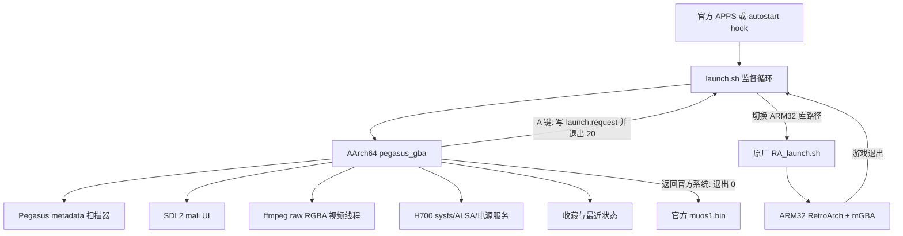

# 天马 GBA 极简前端：H700 完整开发与落地文档

版本：0.16（设置、亮度、预览音频与物理音量修复，已部署）  
日期：2026-08-08  
目标设备：ANBERNIC RG34XXSP-class，Allwinner H700，原厂 Linux  
显示：720x480，3:2 横屏  
工程目录：`D:\Works\PegasusG by ROC`

## 1. 文档目的

本文是产品需求、设备契约、软件架构、内容格式、构建部署、回滚方案和验收记录的统一基线。后续修改前端、主题、模拟器启动器或原厂系统集成时，应先更新本文中的接口与测试矩阵。

本项目的目标不是移植完整 Qt/QML Pegasus，而是在 H700 原厂显示栈上实现一个兼容 Pegasus 游戏包的专用 AArch64 SDL2 前端。产品只服务 GBA 游戏，保留必要的系统功能，减少启动时间、内存占用和设置复杂度。

## 2. 产品范围

### 2.1 必须具备

1. 官方应用中心内存在“天马GBA极简前端”入口。
2. 首次从应用中心启动后，可在设置中开启开机自动进入；可随时关闭。
3. 顶部只显示“最近游戏、GBA、GBA改版、GBA震动、收藏”。
4. 左侧显示所选游戏的视频预览、标题、开发信息和中文简介。
5. 右侧显示 4x3 封面网格，A 键以最短稳定链路启动 GBA。
6. 默认使用 mGBA 直接加载中文 ZIP；mGBA 缺失时才回退 gpSP。
7. 收藏、最近游戏和设置跨重启保存。
8. 识别卡1 `/mnt/mmc` 与卡2 `/mnt/sdcard` 中的 Pegasus 内容。
9. 显示时间、电池百分比和充电状态。
10. 物理音量键调整 0..9 级音量并显示数字 OSD。
11. 设置页只提供返回官方系统、开机自动进入开关、屏幕亮度和音量。
12. 前端合盖待机、开盖继续；游戏内沿用原厂 RetroArch 电源链。

### 2.2 首版明确不做

- 通用主题引擎、主题切换、在线下载、刮削器和账号系统。
- GB、GBC、其他模拟平台入口。
- RetroArch 全量设置的前端镜像。
- 3 秒冷启动承诺或对 U-Boot、内核、systemd 的激进裁剪。
- 对 metadata 中 Android `am start` 命令的执行。

## 3. 可行性与难度结论

结论：可落地，整体难度中高。难点主要来自原厂系统集成，不是游戏列表 UI。

| 子系统 | 难度 | 结论 |
|---|---:|---|
| AArch64 前端 | 中 | 已交叉编译并真机运行 |
| 720x480 UI | 中 | 已完成真实内容截图与真机 framebuffer 验证 |
| Pegasus 内容兼容 | 中 | 已完成解析、素材推导、缺失 ROM 过滤 |
| 视频预览 | 中高 | 已解决系统 ffmpeg/fontconfig/动态库冲突并真机动态抓帧 |
| RetroArch | 中高 | 已解决 AArch64 前端到 ARM32 RA 的 ABI 环境切换和中文 ZIP/core 兼容问题 |
| 显示独占 | 高 | 原厂 service 无法正常 stop 子进程，已形成单实例清理/恢复方案 |
| 开机自启动 | 高 | hook 已实现为有标记、可禁用、可卸载；当前已启用，仍需长测 |
| 合盖与恢复 | 高 | 进程重建和 AXP2202 `os_sleep_type=1` 已接入，仍需实物开盖唤醒回归 |

从零估算完整产品化周期为 3 到 5 周；当前 0.16 源码、安装包和真机部署已完成。亮度、设置音量、视频预览声音和物理音量减已真机确认；剩余工作主要是全按键、游戏往返、合盖、双卡和冷启动长测，而不是重新选型。

## 4. 设备与原厂系统契约

详细硬件报告见 `docs/RG34XXSP_H700_SYSTEM_HARDWARE_BASELINE.md`。实现必须遵守以下事实：

| 项目 | 实测值 | 开发约束 |
|---|---|---|
| CPU | 4x Cortex-A53，AArch64 | 前端编译为 AArch64 |
| 内存 | 约 973 MiB，无 swap | 图片缓存有上限，不能预解码全库 |
| 内核 | Linux 4.9.170 vendor BSP | 不依赖新内核接口 |
| 显示 | `/dev/fb0 + /dev/disp + /dev/ion + /dev/mali0` | 无 DRM/KMS、X11、Wayland |
| LCD | 720x480，32 bpp，双页 720x960 | UI 固定以 720x480 为逻辑坐标 |
| SDL | 厂商 SDL2 2.28.5，`mali` 后端 | 运行前必须释放官方显示所有者 |
| 前端 ABI | AArch64 | 使用系统 AArch64 SDL/image/ttf |
| RetroArch ABI | ARM32 | 启动前切到 `/usr/lib32:/usr/lib:/mnt/vendor/lib` |
| 电池 | AXP2202 sysfs | 读取 capacity/status，亮度与 hall 为厂商节点 |
| 卡1 | `/mnt/mmc` FAT32，部署后约 223 MiB 可用 | 只放约 10 MiB 应用，不放完整素材包 |
| 卡2 | `/mnt/sdcard` exFAT，部署后约 9.9 GiB 可用 | 完整 2.81 GB 内容包放卡2 |

原厂 `launcher.service` 是 SysV generator 生成的 `Type=forking + RemainAfterExit + MainPID=0 + KillMode=process`。`systemctl stop launcher.service` 不会清理 `dmenu_ln/muos1.bin` 子进程。任何调试和接管流程必须按实际 PID/进程组释放显示，并确保恢复后只有一个 `muos1.bin`。

## 5. 游戏包审计

源包：

`<external-content>\PG_天马G_极简包V1_02_GBA_GB_GBC_Roms`

实际内容根：

`Roms\GBA`

| 指标 | 结果 |
|---|---:|
| 总文件 | 1,636 |
| 总大小 | 2,811,419,503 bytes |
| metadata | 1 个，328,632 bytes |
| metadata 游戏条目 | 466 |
| 单 ROM 条目 | 458 |
| 多 ROM 条目 | 8 |
| 实际可启动游戏 | 236 |
| 当前 GBA / GBA改版分类 | 230 / 6 |
| 缺失 ROM、仅有素材的条目 | 230 |
| PNG | 857 |
| JPG | 75 |
| MP4 | 466 |
| ROM ZIP | 237（含多文件条目的备用 ROM） |

导入规则：

1. 只显示至少存在一个 ROM 文件的 metadata 条目。
2. 普通条目按 `media/<game>/boxfront.png|logo.png|video.mp4` 推导素材。
3. 显式 `assets.box_front/logo/video` 优先于约定路径。
4. 多 ROM 条目首版点击直接启动第一项，备用文件保留在模型中。
5. metadata 顶部 Android 启动命令被忽略，统一改走 H700 启动器。
6. 同一路径 ROM 跨 metadata 去重。
7. 0.27 起优先按元数据 `collection` 将 `GBA`、`GBA hack`、`GBA vib` 映射到三个游戏页签；只有未知旧包才使用标题、开发信息、路径关键词和 `config/mods.txt` 回退识别。

内容在设备上的推荐目录：

```text
/mnt/sdcard/Roms/GBA/
  metadata.pegasus.txt
  *.zip
  media/<游戏名>/boxfront.png
  media/<游戏名>/logo.png
  media/<游戏名>/video.mp4
/mnt/sdcard/Roms/GBA hack/
  metadata.pegasus.txt
  *.zip 或子目录/*.zip
  media/<游戏名>/...
/mnt/sdcard/Roms/GBA vib/
  metadata.pegasus.txt
  *.zip
  media/<游戏名>/...
```

卡一 `/mnt/mmc` 和卡二 `/mnt/sdcard` 均扫描上述三个同级目录。`GBA vib` 默认使用随 PegasusG 打包的独立 gpSP 震动核心，不覆盖原厂 gpSP。

2026-08-07 已将完整内容部署到上述卡2目录。设备端普通文件统计为 1,636 个、2,811,419,503 bytes，与本地源包完全一致。

## 6. 软件架构



核心源码：

| 文件 | 职责 |
|---|---|
| `src/pegasus_metadata.cpp` | metadata 流式解析、路径解析、过滤、分类、报告 |
| `src/gba_state.cpp` | 收藏与最近顺序原子持久化 |
| `src/gba_frontend.cpp` | 720x480 UI、输入、筛选、启动请求、OSD |
| `src/video_preview.cpp` | ffmpeg 子进程、RGBA 帧线程和安全停止 |
| `src/h700_services.cpp` | 电池、亮度、音量、hall、电源、自启动 |
| `H700/launcher/launch.sh` | AArch64/ARM32 环境切换和前端/游戏监督循环 |
| `H700/launcher/autostart_ctl.sh` | 可逆 marker hook 安装、禁用和卸载 |

## 7. UI 规范

逻辑画布固定为 720x480，物理输出由 SDL logical size 处理。

- 参考来源：960x640 `pegasusG-Grid` 覆盖配置和私有安卓实机照片，按 0.75 比例及 H700 可读性重新排版；原始照片不纳入公开仓库。
- 整体：纯黑媒体墙，不使用浅色面板；左栏 240 px，右侧网格 480 px。
- 顶栏：`y=0..44`，斜切分隔的五个文字 tab；选中态为与分隔线共边的斜平行四边形；右侧显示时间、电池百分比、充电 `+`、当前序号和分类。
- 左信息：logo `x=18, y=52, w=204, h=67`；居中标题 17 px。
- 左预览：`x=13, y=151, w=214, h=120`，约 16:9 视频区域；下方为开发信息和最多 9 行简介。
- 右网格：起点 `x=240, y=45`，4 列、单格 120x120、无列间距；显示 3 行并露出第 4 行，标题以半透明黑底覆盖在封面底部。
- 选中项：白色外线配金色内线；收藏项使用金色标记。
- 设置：全屏深色遮罩，三行固定操作，不存在二级通用设置树。
- OSD：音量、亮度和操作结果显示在屏幕中部，默认 1.3 到 1.6 秒。

素材源封面为 600x600，网格采用等比 contain；左侧无视频帧时采用 cover crop。视频按 300x169、RGBA 解码，显示时缩放到 214x120；前端使用单调时钟每 66.667 ms 发布一帧，避免 rawvideo 被全速消费。0.16 的音频由 ffmpeg 解码为 44.1 kHz 双声道 PCM，再由前端直接写 ALSA，开始和停止各做 20 ms 淡入淡出，不再使用外部 aplay。

## 8. 输入契约

| 动作 | 前端 |
|---|---|
| D-pad | 封面移动；设置上下选择/亮度左右调整 |
| A | 启动游戏或确认设置 |
| B | 打开/关闭极简设置 |
| X | 收藏/取消收藏 |
| L1/R1 | 切换五个顶栏分类 |
| Menu/Start | 打开设置 |
| Volume -/+ | 0..9 级 ALSA 音量，显示数字 OSD |
| Power | 调用原厂 `pwr_new.sh` 进入 mem suspend |

设备 BTN 常量与 SDL 标准语义并不完全一致。代码同时支持 SDL GameController、raw joystick button 和键盘/evdev 路径。正式发布前必须用实机逐键确认 A/B/X/L1/R1/Menu/音量/Power，不以桌面键盘测试代替。

## 9. 游戏启动与返回

前端不与 RetroArch 并发持有 framebuffer：

1. 用户按 A。
2. 更新最近顺序并原子保存状态。
3. 写 `$STATE/launch.request`，内容只有已验证的绝对 ROM 路径。
4. 前端退出码为 20，析构时停止 ffmpeg 并释放 SDL/Mali。
5. `launch.sh` 只接受 `/mnt/mmc/*` 或 `/mnt/sdcard/*`，拒绝其他路径。
6. 设置 ARM32 `LD_LIBRARY_PATH=/usr/lib32:/usr/lib:/mnt/vendor/lib`。
7. 调用 `/mnt/mod/ctrl/RA_launch.sh gpsp_libretro.so <ROM> auto`。
8. 默认使用 `mgba_libretro.so`；仅在该核心缺失时回退 `gpsp_libretro.so`。
9. RetroArch 退出后重新启动前端；设置中的“返回官方系统”退出监督循环。

该设计保留原厂 GBA 配置、按键、自动存档、shader/bezel、电源和合盖处理。

## 10. 状态与硬件服务

持久状态默认放在 ext4：

```text
/mnt/data/roc-gba-shell/
  games.tsv
  volume.level
  autostart.enabled
  app.path
  autostart.original
  autostart_launch.sh
  logs/PegasusGBA.log
```

避免把高频状态写到 FAT32 卡1。`games.tsv` 使用稳定 ROM 路径哈希作为 ID，只记录有收藏或最近状态的条目，写入时先生成临时文件再 rename。

硬件节点：

```text
/sys/class/power_supply/axp2202-battery/capacity
/sys/class/power_supply/axp2202-battery/status
/sys/class/power_supply/axp2202-battery/brightness
/sys/class/power_supply/axp2202-battery/hallkey
/sys/class/power_supply/axp2202-battery/openbor_volume
```

亮度首版限制 1..10。音量映射到 ALSA `lineout volume` 0..31 和 `SPK Switch`，逻辑显示 0..9。合盖以 250 ms 轮询检测 hall `1 -> 0`，先向 AXP2202 `os_sleep` 写入原厂值 `16`（内核确认为 `os_sleep_type=1`），再调用 `/mnt/vendor/ctrl/pwr_new.sh auto`；恢复后重建前端进程并重新启动所选视频。

## 11. 自启动与回滚

自启动只修改 `/mnt/mod/ctrl/autostart`，且遵守：

1. 首次安装前备份到 `/mnt/data/roc-gba-shell/autostart.original`。
2. 插入 `BEGIN/END ROC PEGASUS GBA AUTOSTART` 标记块。
3. 标记块放在原脚本 `exit 0` 前。
4. `enable` 创建 flag；`disable` 只移除 flag；`uninstall` 恢复备份。
5. 固定 shim 位于 `/mnt/data`，应用可在卡1或卡2。
6. 前端前台阻塞原 autostart，退出 0 后原启动链继续进入官方系统。

命令：

```sh
/mnt/mmc/Roms/APPS/PegasusGBA/autostart_ctl.sh enable
/mnt/mmc/Roms/APPS/PegasusGBA/autostart_ctl.sh disable
/mnt/mmc/Roms/APPS/PegasusGBA/autostart_ctl.sh uninstall
```

不得用覆盖整个 `/mnt/mod/ctrl/autostart` 的方式发布更新。

## 12. 构建与包结构

Windows/WSL 构建：

```powershell
cd 'D:\Works\PegasusG by ROC'
.\H700\build_app.ps1 -Version 0.15 -Output Zip
```

输出：

`H700\Downloads\PegasusGBA ver0.15 for H700 app.zip`

安装后结构：

```text
/mnt/mmc/Roms/APPS/PegasusGBA.sh
/mnt/mmc/Roms/APPS/PegasusGBA/
  pegasus_gba
  launch.sh
  autostart_ctl.sh
  autostart_launch.sh
  config/mods.txt
  assets/fonts/ui_font_02.ttf
```

前端是 AArch64 ELF，最高 GLIBC 需求 2.34；样机为 glibc 2.35。设备系统已提供 SDL2_image、SDL2_ttf、freetype、libstdc++，发行包不携带旧 ROC 的 77 MiB 通用运行库。当前应用 staging 约 9.6 MiB，ZIP 约 4.3 MiB。

正式交付包：

`H700\Downloads\PegasusGBA ver0.15 for H700 app.zip`

| 交付对象 | SHA-256 |
|---|---|
| ZIP | `fff41507d210890e57c25bb349946c1921e7fdd60e0bd8452bb6af36aa8f0a56` |
| `pegasus_gba` | `8e12e73e1ac5dbac23280e1507ca03e28f68c8cb88ea88a6d7ebf3fb1c819d61` |
| `launch.sh` | `5446074bebbf073870ed83e03cadaad2ef874ee9ed4da277cc4b51ec7e73f15a` |
| 封面缩略图归档 | `c39a55dc1325e53c8aa59be5800ab200a92b985dfe8cde2afbf4ddbe72646746` |

0.15 staging 已完成逐字节哈希记录并原子部署到真机；设备二进制和脚本哈希与 staging 一致，版本文件为 `0.15`。安装位置为 `/mnt/mmc/Roms/APPS/PegasusGBA.sh` 和 `/mnt/mmc/Roms/APPS/PegasusGBA/`，部署前版本保留为 `/mnt/mmc/Roms/APPS/PegasusGBA.bak-0.13`。

## 13. 性能与启动预算

正常启动链实测：kernel 2.358 s，userspace 8.777 s，总计 11.136 s；官方 `muos1.bin` 约在内核起点后 9.86 s 出现。

兼容自启动目标：

- 0.15 受控冷启动实测：launcher 在 Linux uptime 9.97 秒进入，前端在 10.00 秒启动，内容扫描 378 ms，初始化完成 1,461 ms，第一帧完成 2,283 ms；即 Linux 起点到可见首屏约 12.28 秒。加 U-Boot/开机图，按电源到界面预计约 15 到 18 秒，仍需 10 次冷启动取得 P50/P95。
- 0.15 有历史记录时默认进入“最近游戏”，最近玩的条目排第一。用户看到首屏后直接按 A，不再重复导航；这会消除本次 30 秒人工流程中实测约 11 秒的找游戏时间。
- 选择游戏到原厂 `RA_launch.sh` 执行 RetroArch 的既有日志差约 1 秒；RA 真实首帧仍需摄像或显示侧人工计时。
- 前端常驻 RSS：实测 49,504 KiB，低于 120 MiB 预算；稳态采样时系统 MemAvailable 868,328 KiB。
- 渲染循环有显式约 60 fps 上限。视频结束、无 ffmpeg 子进程时的 10 秒稳态采样为单核 32.0%，即整机四核 CPU 容量约 8.0%；后续可通过脏区重绘或空闲降帧继续优化。
- 图片纹理缓存：64 项 LRU，达到上限后只淘汰最久未使用的一张，不再整池释放。
- 封面优先加载 120x120、24-bit BMP 缩略图。466 张共 20,156,364 bytes，平均 43,254 bytes；原 PNG 平均约 749 KiB，逐行读取量降低约 17 倍。缺少缩略图时兼容回退原图。
- 0.13 真机 dummy framebuffer 诊断从扫描 236 个可用条目到生成首屏 PNG 共 1.72 秒；正常前端首屏常驻 RSS 实测 37,380 KiB。
- 视频：单路 300x169 RGBA，由前端单调时钟限制为 15 fps；真机探针 3 秒收到 42 帧。0.16 增加单路 44.1 kHz 双声道 ALSA 预览音频、20 ms 淡入淡出，并延迟 300 ms 启动以减少快速翻页时的进程抖动。

“3 秒开机”不属于原厂正常启动链可以兑现的指标。要达到该目标必须改 U-Boot、内核和 systemd 启动编排，并会牺牲兼容性；不进入当前稳定链。

当前提速边界分三档：

1. 稳定链（当前默认）：保留原厂 autostart 前置工作、`RA_launch.sh`、Power/hall 和双卡挂载，预计按电源到直接按 A 进入游戏约 16 到 19 秒。
2. 并行启动实验（尚未启用）：原厂 autostart 全段复跑仅 0.130 秒，提前 Pegasus hook 没有实际价值。可实验把 `loadapp.sh` 中 NetworkManager/蓝牙重启改为后台并行；本次时间戳为 NetworkManager 8.32–8.41 秒、蓝牙 9.18–9.47 秒、Pegasus launcher 9.97 秒，理论收益约 0.5 到 1.0 秒。该修改触及 vendor 启动脚本，必须提供逐字节备份、原子安装和 Wi-Fi/蓝牙/双卡/SSH 回归后才能默认开启。
3. 激进模式（不建议默认）：自动启动最近游戏可绕过约 2.28 秒前端首帧；绕过 `RA_launch.sh` 理论上再省约 1 秒，但会增加存档路径、shader/bezel、自动状态、音量和休眠行为偏离原厂的风险。

### 13.1 0.13 游戏启动与封面性能修复

设备上的 gpSP 声明只接受未压缩 `gba|bin`，因此 RetroArch 会先解压 ZIP。内容包的 ZIP 成员名采用中文旧编码，RetroArch 1.22.0 组合出的成员路径与 ZIP 原始字节不一致，verbose 日志明确报“从压缩包中解压游戏失败”。对照结果：gpSP + 原 ZIP 立即退出；gpSP + 解压后的 ASCII `.gba` 持续运行；mGBA + 原 ZIP 和 mGBA + `.gba` 均持续运行。因此 0.13 默认选择 mGBA，而不是通过每次解压或改写内容包来绕过问题。

0.12 在缓存达到 28 张时销毁全部纹理。一屏会访问约 16 张封面及左栏素材，向下滚动很快触发整屏 600x600 PNG 重解码。0.13 改成 64 项 LRU 单张淘汰，并由 `H700/generate_thumbnails.py` 为内容包生成与原图同目录、同 stem 的 `.h700.bmp`；运行时自动优先选择该文件。0.27 将默认缩略图从 120x120 升为 192x192，以覆盖三列大格子 115% 放大后的实际尺寸，并加入并行生成；最终 2026 整合包已生成 602 张。

### 13.2 0.11 电源恢复修复

0.10 在前端进程内部同步执行 `/mnt/vendor/ctrl/pwr_new.sh`。该脚本最终写入 `/sys/power/state`，进程跨 suspend 保留了休眠前的 Mali renderer、framebuffer 和 SDL input 文件描述符。唤醒后这些句柄可能已经失效，表现为十字键无响应，第一次重绘后黑屏，严重时 SSH 只接受 TCP 连接但不发送 banner。

0.11 将休眠改为进程边界协议：

1. Power 键令前端停止视频并以退出码 21 退出；hall 合盖使用退出码 22。
2. C++ 析构顺序释放 ffmpeg、纹理、字体、controller/joystick、renderer、window 和 SDL。
3. `launch.sh` 在确认前端完全退出后调用原厂 `pwr_new.sh`；合盖时附加 `auto`。
4. 原厂脚本从 suspend 返回后，监督循环启动全新的前端进程，重新扫描内容并重开 `/dev/input/event0..2`、Mali 和 `/dev/fb0`。

2026-08-07 真机连续完成两次 Power 熄屏/唤醒。两次日志均为 `frontend exited rc=21 -> suspending reason=power -> resumed rc=0 -> starting frontend`；第二次恢复后的新 PID 为 3626，独占 `/dev/fb0`，重新持有 `event0/event1/event2`，十字键连续切换游戏并产生对应视频选择日志，未再次黑屏。安全修复当前会在唤醒后重新扫描内容，界面恢复约需 4 到 8 秒；后续可用目录缓存缩短，但不得恢复为同进程跨 suspend。

### 13.3 0.14 五栏导航

顶部顺序调整为“最近游戏、GBA、GBA改版、GBA震动、收藏”，LB/RB 在 5 个 tab 间循环。震动条目通过标题、开发者或 ROM 路径中的 `震动`、`振动`、`震動`、`rumble`、`vibration` 标记识别，并从普通 GBA 和改版栏排除；收藏和最近游戏仍可跨分类显示。当前内容包没有这些标记，因此首次部署时该栏为空。

选中态不再使用矩形填充。实现使用两个三角形组成平行四边形，其左右斜边与 tab 分隔线使用相同 8 px 偏移；五栏总宽 488 px，结束位置为 x=500，不侵占 x=603 起的时间和电池区域。

### 13.4 0.15 冷启动直达与计时

状态文件存在游玩历史时，启动页从普通 GBA 改为“最近游戏”，并按 `recent_order` 让最后启动的游戏排第一。没有历史或最近列表为空时仍安全回退 GBA，不改变五栏筛选、收藏或内容解析语义。

launcher 和前端新增 `/proc/uptime`、内容扫描、初始化、第一帧与游戏请求计时日志。计时仅写入既有日志，不增加启动同步点；用于把 bootloader、Linux userspace、前端、人工选择和 RetroArch 分段测量。

## 14. 已执行验证

| 验证 | 结果 |
|---|---|
| 本机 C++17 编译 | 通过，无编译告警 |
| 单元测试 | layout/catalog/online source/Pegasus parser 全通过 |
| 真实包扫描 | 466 parsed / 236 available / 230 hidden |
| 720x480 截图 | 通过，无文字和控件重叠 |
| 0.12 Grid 参考布局 | 真实 236 条内容离屏截图及 H700 双页 framebuffer 均通过 |
| AArch64 交叉构建 | 通过 |
| ELF ABI | AArch64，GLIBC <= 2.34，设备 2.35 |
| 设备动态链接 | 所有 NEEDED 库解析成功 |
| SDL `mali` 真机显示 | 通过 |
| framebuffer 独占 | 通过，运行时仅 `pegasus_gba` 进程树持有 |
| 双缓冲抓帧 | 两页均为正确 720x480 前端画面 |
| 电池/充电显示 | 通过，真机显示 `+92%` 样本 |
| 视频动态预览 | 通过，ffmpeg 常驻且间隔帧 hash 不同 |
| gpSP/中文成员名 ZIP | 失败原因已定位：RetroArch 解压成员路径编码不匹配；不再作为默认链路 |
| mGBA/同一中文 ZIP | 后台无显示诊断持续运行超过超时；0.13 已部署，真实画面/输入待人工确认 |
| 官方系统恢复 | 通过，恢复后恰好 1 个 muos1.bin |
| 自启动实际开机 | 两次冷启动通过；最终版本次为 kernel+userspace 8.427 s，前端进程 9.92 s 启动 |
| 0.15 冷启动首帧 | launcher 9.97 s；frontend 10.00 s；scan 378 ms；first present 12.28 s |
| 0.15 默认选中 | 真机双页 framebuffer 均确认“最近游戏”选中且《塞尔达传说 缩小帽》为第一项 |
| 最终版文件/运行状态 | 设备 ELF SHA-256 与 staging 一致；无 muos1.bin，fb0 仅由 pegasus_gba 持有 |
| 60 fps 上限后稳态 | 无 ffmpeg 时单核 32.0%，RSS 49,504 KiB，MemAvailable 868,328 KiB |
| 完整内容部署 | 卡2文件数与字节数均与本地一致 |
| Power 熄屏/唤醒 | 0.11 连续 2 次通过；新进程、新 SDL 输入句柄，恢复后十字键有效且无黑屏 |
| 物理全按键 | 待人工逐键确认 |
| 前端合盖/开盖 | 0.12 合盖休眠通过但开盖不能唤醒；0.13 已补原厂 `os_sleep_type=1`，待实物复验 |
| 游戏中合盖/开盖 | 复用原厂链，待本项目专项确认 |
| 20 次游戏往返 | 完整内容已部署，待人工长测 |

测试原始脚本和日志采集入口位于：

私有设备采集目录（公开仓库已排除）

## 15. 发布闸门

0.15 进入日常使用前必须完成：

1. `[已完成]` 卡2完整内容文件数和字节数核对。
2. `[待人工长测]` 从官方 APPS 入口启动并返回 10 次。
3. `[部分完成]` Power 熄屏/唤醒已连续 2 次通过；A/B/X/L/R/Menu/音量仍需逐键确认。
4. `[待人工验收]` 前端合盖 10 次，游戏中合盖 10 次，每次确认音频、画面、输入恢复。
5. `[待人工长测]` mGBA 启动/退出 20 次，至少覆盖中文名、长文件名和改版 ROM。
6. `[已完成 2/10]` 开启自启动后冷启动 10 次，记录首帧时间和失败次数。
7. `[部分完成]` enable/disable/uninstall 可逆性及原脚本哈希已通过；仍需关闭自启动后重启确认直接回官方系统。
8. `[待人工验收]` 拔出卡2后启动，确认前端显示空库且可以返回官方系统。
9. `[待人工验收]` 插入卡1/卡2不同内容，确认去重与状态路径稳定。

## 16. 已知风险与后续工作

- 设备 RTC/NTP 当前不可信，时间 UI 能显示系统时间，但不能保证真实时刻。
- metadata 对 230 个游戏只提供素材不提供 ROM；前端正确隐藏，但内容包维护者应清理或补齐。
- 8 个多 ROM 条目首版直接启动第一项；若产品需要选择不同改版，应增加轻量文件选择层。
- 最终 2026 整合包按 `collection` 分类；其 GBA hack 元数据中的仙剑奇侠传 7、8、9 卷缺少声明的 ROM，发布前应补齐或删除对应条目。
- 主题 Grid 的 README 标注 CC BY-NC-SA 4.0；商业分发前必须确认视觉资产授权。本实现复刻信息结构，不打包完整主题资源。
- 合盖和其余物理键属于硬件行为，不能只靠 SSH/截图宣告完成；Power 键已在 0.11 连续完成两次人工测试。
- 原厂 service 的子进程管理有缺陷，调试脚本必须使用项目提供的单实例恢复流程。
- 新增内容若没有 `.h700.bmp` 仍可显示原封面，但首次滚入该行会较慢；发布内容包前应运行 `H700/generate_thumbnails.py`，并把生成文件一并封装进 ROM 包。

## 17. 交付物

- 主开发文档：本文。
- 系统硬件基线：`docs/RG34XXSP_H700_SYSTEM_HARDWARE_BASELINE.md`。
- 端口分析：`docs/PEGASUS_H700_PORTING_ANALYSIS.md`。
- 实施规划：`docs/RG34XXSP_GBA_MINIMAL_FRONTEND_IMPLEMENTATION_PLAN.md`。
- 应用源码：`src/`。
- H700 构建和入口：`H700/`。
- 真实内容截图：`screenshots/pegasus-gba-real-720x480.png`。
- 真机 framebuffer 截图：`screenshots/PegasusGBA-device-page0.png`。
- 0.12 Grid 离屏截图：`screenshots/PegasusGBA-grid-dark-720x480.png`。
- 0.12 真机 framebuffer：`screenshots/PegasusGBA-0.12-device-page0.png` 和 `screenshots/PegasusGBA-0.12-device-page1.png`。
- 0.13 应用包：`H700/Downloads/PegasusGBA ver0.13 for H700 app.zip`。
- 0.14 应用包：`H700/Downloads/PegasusGBA ver0.14 for H700 app.zip`。
- 0.14 五栏导航回归：`screenshots/PegasusGBA-0.14-five-tabs.png`。
- 0.15 应用包：`H700/Downloads/PegasusGBA ver0.15 for H700 app.zip`。
- 0.15 真机启动首屏：`screenshots/PegasusGBA-0.15-boot-page0.png` 和 `screenshots/PegasusGBA-0.15-boot-page1.png`。
- 0.13 封面缩略图：`H700/Downloads/PegasusGBA H700 cover thumbnails.tar.gz`。
- 0.13 真机真实内容缩略图回归：`screenshots/PegasusGBA-0.13-thumbnail-device-dummy.png`。
- 可重复探测/测试脚本：保存在私有设备采集目录，公开仓库不包含设备凭据和原始日志。
