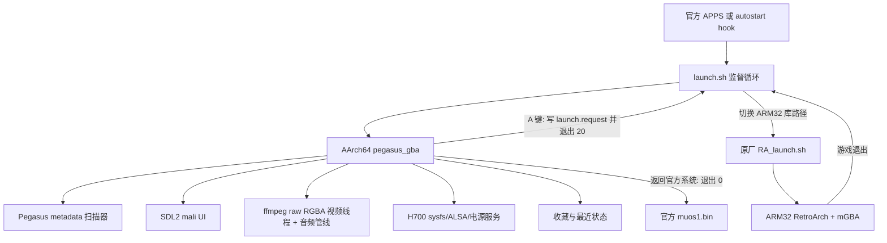

# H700 天马 GBA 极简前端：交接基线文档

版本：0.33 已部署 / 列表核心优先级与震动游戏核心兜底修复已完成真机验证  
日期：2026-08-11  
用途：本文件用于在新 Codex 窗口独立继续本项目，基础开发信息与当前待修 BUG 分开归档。

## 如何使用本文件

- 工程根目录：`D:\Works\PegasusG by ROC`
- 设备 SSH：`root@<device-ip>`，密码由设备所有者自行设置，禁止提交真实凭据
- 主开发文档：`docs/PEGASUS_GBA_H700_COMPLETE_DEVELOPMENT_DOCUMENT.md`
- 新窗口第一步建议：先读本文件第一部分建立基线，再读第二部分按优先级处理 BUG，最后参考主开发文档的发布闸门。

---

# 第一部分：基础开发信息

## 1. 项目定位

目标不是移植完整 Qt/QML Pegasus，而是在 H700 原厂 Linux 上实现一个兼容 Pegasus 游戏包的专用 AArch64 SDL2 前端。产品只服务 GBA 游戏，保留必要系统功能，减少启动时间、内存占用和设置复杂度。

当前已交付 0.20：

- 官方 APPS 有“天马GBA极简前端”入口。
- 开机自启动 hook 可启用、禁用、卸载。
- 顶部五栏：最近游戏、GBA、GBA改版、GBA震动、收藏。
- 左侧视频预览、标题、开发信息、中文简介；右侧 4x3 封面网格。
- A 键经原厂 `RA_launch.sh` 启动 ARM32 RetroArch + mGBA。
- 收藏、最近游戏、音量、自启动状态跨重启保存。
- 双卡 `/mnt/mmc`、`/mnt/sdcard` 内容扫描。
- 顶栏时间、电池百分比、充电状态。
- 物理音量键 0..9 级 ALSA 音量并显示数字 OSD。
- Power 键与合盖走进程边界休眠重建，恢复后重新持有 SDL/输入/Mali。

## 2. 设备与原厂系统契约

| 项目 | 实测值 | 开发约束 |
|---|---|---|
| CPU | 4x Cortex-A53，AArch64 | 前端编译为 AArch64 |
| 内存 | 约 973 MiB，无 swap | 图片缓存有上限，不能预解码全库 |
| 内核 | Linux 4.9.170 vendor BSP | 不依赖新内核接口 |
| 显示 | `/dev/fb0 + /dev/disp + /dev/ion + /dev/mali0` | 无 DRM/KMS、X11、Wayland |
| LCD | 720x480，32 bpp，双页 720x960 | UI 固定以 720x480 为逻辑坐标 |
| SDL | 厂商 SDL2 2.28.5，`mali` 后端 | 运行前必须释放官方显示所有者 |
| 前端 ABI | AArch64 | 使用系统 AArch64 SDL/image/ttf |
| RetroArch ABI | ARM32 | 启动前切到 `/usr/lib32:/usr/lib:/mnt/vendor/lib` |
| 电池 | AXP2202 sysfs | 读取 capacity/status，亮度与 hall 为厂商节点 |
| 卡1 | `/mnt/mmc` FAT32 | 只放约 10 MiB 应用，不放完整素材包 |
| 卡2 | `/mnt/sdcard` exFAT | 完整 2.81 GB 内容包放卡2 |

原厂 `launcher.service` 是 SysV generator 生成，`systemctl stop launcher.service` 不会清理 `dmenu_ln/muos1.bin` 子进程。调试和接管必须按实际 PID/进程组释放显示，恢复后只允许一个 `muos1.bin`。

## 3. 仓库结构与关键文件

```text
D:\Works\PegasusG by ROC\
  src\                       前端 C++ 源码
  tests\                     逻辑测试
  H700\build_app.ps1         Windows 构建入口
  H700\build_app.sh          WSL 构建脚本
  H700\launcher\             安装包脚本
  H700\Downloads\            历史安装包
  docs\                      全部开发与硬件文档
  screenshots\               真机与离屏截图
  PG_天马G_极简包V1_02_GBA_GB_GBC_Roms\  内容源包
  <external-reference>\pegasus-frontend\  960x640 参考主题（不纳入公开仓库）
```

核心源码职责：

| 文件 | 职责 |
|---|---|
| `src/pegasus_metadata.cpp` | metadata 流式解析、路径解析、过滤、分类、报告 |
| `src/gba_state.cpp` | 收藏与最近顺序原子持久化 |
| `src/gba_frontend.cpp` | 720x480 UI、输入、筛选、启动请求、OSD |
| `src/video_preview.cpp` | ffmpeg 解码、15 fps 单调时钟节流、RGBA 帧线程、进程内 ALSA 淡入淡出 |
| `src/h700_services.cpp` | 电池、亮度、音量、hall、电源、自启动 |
| `H700/launcher/launch.sh` | AArch64/ARM32 环境切换和前端/游戏监督循环 |
| `H700/launcher/autostart_ctl.sh` | 可逆 marker hook 安装、禁用和卸载 |

## 4. 软件架构



## 5. 构建与打包

Windows 构建（内部调用 WSL）：

```powershell
cd 'D:\Works\PegasusG by ROC'
.\H700\build_app.ps1 -Version 0.16 -Output Stage
.\H700\build_app.ps1 -Version 0.16 -Output Zip
```

WSL 直接构建：

```bash
cd '/mnt/d/Works/PegasusG by ROC'
ROCFRONTEND_VERSION=0.16 ROCFRONTEND_OUTPUT=Zip bash ./H700/build_app.sh
```

默认 sysroot：项目内可选目录 `H700\sysroot`，也可通过 `-Sysroot` 显式指定。  
ZIP 输出：`H700\Downloads\PegasusGBA ver0.16 for H700 app.zip`。  
前端是 AArch64 ELF，最高 GLIBC 需求 2.34；设备为 glibc 2.35。设备已提供 SDL2/SDL2_image/SDL2_ttf/freetype/libstdc++，发行包不携带通用运行库。

本机逻辑测试：

```bash
cd '/mnt/d/Works/PegasusG by ROC'
make all
make test
```

测试套件：`layout_test`、`catalog_test`、`online_sources_test`、`pegasus_metadata_test`。0.15 与 0.16 本机代码均已通过。

## 6. 安装与部署

安装后结构：

```text
/mnt/mmc/Roms/APPS/PegasusGBA.sh
/mnt/mmc/Roms/APPS/PegasusGBA/
  pegasus_gba
  launch.sh
  autostart_ctl.sh
  autostart_launch.sh
  config/mods.txt
  assets/fonts/ui_font_02.ttf
```

应用中心入口由 `Roms/APPS/PegasusGBA.sh` 转发到 `PegasusGBA/launch.sh`。升级真机前必须保留旧版本备份，例如 `/mnt/mmc/Roms/APPS/PegasusGBA.bak-0.13`；当前设备上有该 0.13 备份。

内容扫描根目录：

```text
/mnt/mmc/Roms/GBA
/mnt/sdcard/Roms/GBA
```

推荐卡2内容树：

```text
/mnt/sdcard/Roms/GBA/PegasusGBA/
  metadata.pegasus.txt
  *.zip
  media/<游戏名>/boxfront.png
  media/<游戏名>/logo.png
  media/<游戏名>/video.mp4
```

封面和 Logo 快速纹理生成：

```powershell
.\H700\generate_thumbnails.ps1 -Root 'D:\path\to\Roms'
```

封面生成 `192x192`、Logo 生成 `256x96` 的 24-bit `.h700.bmp`；缺失时自动回退原图。

## 7. 自启动与回滚

命令：

```sh
/mnt/mmc/Roms/APPS/PegasusGBA/autostart_ctl.sh enable
/mnt/mmc/Roms/APPS/PegasusGBA/autostart_ctl.sh disable
/mnt/mmc/Roms/APPS/PegasusGBA/autostart_ctl.sh uninstall
```

机制：

1. 首次安装前备份 `/mnt/mod/ctrl/autostart` 到 `/mnt/data/roc-gba-shell/autostart.original`。
2. 在原脚本 `exit 0` 前插入 `BEGIN/END ROC PEGASUS GBA AUTOSTART` 标记块。
3. `enable` 创建 `/mnt/data/roc-gba-shell/autostart.enabled` flag；`disable` 只移除 flag；`uninstall` 恢复备份。
4. 固定 shim 位于 `/mnt/data`，应用可在卡1或卡2。
5. 前端退出 0 后原启动链继续进入官方系统。

不得用整体覆盖 `/mnt/mod/ctrl/autostart` 的方式发布更新。

## 8. 状态、日志与环境变量

状态根目录：

```text
/mnt/data/roc-gba-shell/
  games.tsv
  volume.level
  autostart.enabled
  app.path
  autostart.original
  autostart_launch.sh
  logs/PegasusGBA.log
```

主要日志：

```text
/mnt/data/roc-gba-shell/logs/PegasusGBA.log
/tmp/pegasus-gba-ffmpeg.log
/tmp/pegasus-gba-audio.log
```

常用环境变量：

```sh
ROC_GBA_CONTENT_ROOTS=/custom/root1:/custom/root2
ROC_GBA_STATE_DIR=/mnt/data/roc-gba-shell
ROC_GBA_LAUNCH_REQUEST=/mnt/data/roc-gba-shell/launch.request
ROC_GBA_NO_VIDEO=1
ROC_GBA_DIAGNOSTICS=1
ROC_GBA_APP_DIR=/mnt/mmc/Roms/APPS/PegasusGBA
SDL_VIDEODRIVER=mali
SDL_AUDIODRIVER=alsa
```

## 9. 输入契约

| 动作 | 前端行为 |
|---|---|
| 十字键 | 封面移动；设置上下选择、左右调整值 |
| A | 启动游戏或确认设置 |
| B | 打开设置；设置中返回 |
| X | 收藏/取消收藏 |
| L2/R2 | 五栏分类循环 |
| Select | 封面区与文字介绍区切换；介绍区中再次按 Select、B 或右返回封面 |
| Start | 打开设置；设置中 B 返回主界面 |
| 音量 -/+ | 0..9 级 ALSA 音量，数值短暂显示在顶部 Logo 左侧 |
| Power | 退出码 21，`launch.sh` 调原厂 `pwr_new.sh` 进入 mem suspend |

设备 BTN 常量与 SDL 标准语义不完全一致。代码同时支持 SDL GameController、raw joystick button 和键盘/evdev 路径。正式发布前必须真机逐键确认。

## 10. 电源与盒盖

- 前端退出码：20 = 启动游戏，21 = 手动 Power 休眠，22 = hall 合盖休眠，0 = 返回官方系统。
- `launch.sh` 在确认前端完全退出后调用 `/mnt/vendor/ctrl/pwr_new.sh`；合盖时附加 `auto`。
- 合盖检测：250 ms 轮询 `/sys/class/power_supply/axp2202-battery/hallkey` 的 `1 -> 0`。
- 合盖前写 `/sys/class/power_supply/axp2202-battery/os_sleep` 为 `16`（内核确认为 `os_sleep_type=1`，作为 hall 开盖唤醒源）。
- 休眠必须走进程边界重建：跨 suspend 保留旧 SDL/Mali/输入句柄会导致唤醒后十字键无响应或黑屏。0.11 已修复 Power 键场景并连续两次真机通过。

## 11. 亮度接口（重点）

系统没有 `/sys/class/backlight`。原厂 `muos1.bin` 反汇编结论：

- 打开 `/dev/disp`。
- 清空 16 字节结构，ioctl `0x102` 写亮度；ioctl `0x103` 读。
- 参数布局为 4 个 `unsigned long`，第二个为亮度值。
- 原厂 8 档亮度：`5, 10, 20, 50, 70, 140, 200, 255`。

现有代码路径：

- `/sys/class/power_supply/axp2202-battery/brightness` 只保存逻辑档位，不是面板亮度真正生效接口。
- 0.16 的 `ChangeBrightness()` 已改为先 `/dev/disp` ioctl `0x102`，成功后再写 sysfs 同步状态。
- 0.16 UI 使用 10 档：`5, 10, 20, 35, 50, 70, 100, 140, 200, 255`。

探针文件已写：`.tmp/brightness_probe.cpp`，可验证 `0x103` 读、`0x102` 写。第一次编译结果依赖 GLIBC 2.38，设备无法运行，必须用低 glibc 工具链重编，见第二部分。

## 12. 音量接口

- 逻辑音量 0..9，状态存 `/mnt/data/roc-gba-shell/volume.level`。
- ALSA 控制：`amixer -q -c 0 set 'lineout volume' N`，`N=0..31`。
- 0 级关闭 `SPK`，非 0 级打开 `SPK`。
- 映射公式：`next == 0 ? 0 : 1 + ((next - 1) * 30 + 4) / 8`。

## 13. 游戏内容与启动链路

内容源包：

```text
<external-content>\PG_天马G_极简包V1_02_GBA_GB_GBC_Roms\Roms\GBA
```

审计结果：

| 指标 | 结果 |
|---|---:|
| 总文件 | 1,636 |
| 总大小 | 2,811,419,503 bytes |
| metadata 游戏条目 | 466 |
| 实际可启动游戏 | 236 |
| 当前 GBA / GBA改版 | 230 / 6 |
| 缺失 ROM、仅有素材 | 230 |
| ROM ZIP | 237 |

启动链路：

1. 用户按 A，前端原子保存最近状态。
2. 写 `$STATE/launch.request`，只含已验证绝对 ROM 路径。
3. 前端退出码 20，释放 ffmpeg/SDL/Mali。
4. `launch.sh` 校验路径必须为 `/mnt/mmc/*` 或 `/mnt/sdcard/*`。
5. 设置 `LD_LIBRARY_PATH=/usr/lib32:/usr/lib:/mnt/vendor/lib` 并 `unset LD_PRELOAD`。
6. 调用 `/mnt/mod/ctrl/RA_launch.sh mgba_libretro.so <ROM> auto`；mGBA 缺失时回退 gpSP。

关键兼容结论：gpSP 无法直接读取内容包旧编码中文成员名 ZIP；mGBA 可以直接读取，因此默认 mGBA。

## 14. UI 规范

- 逻辑画布固定 720x480，3:2 横屏，SDL logical size 输出。
- 参考 960x640 `pegasusG-Grid` 覆盖配置，按 0.75 比例重新排版。
- 纯黑媒体墙；左栏 240 px，右侧网格 480 px。
- 顶栏 `y=0..44`，五栏斜切分隔；选中态为与分隔线共边的斜平行四边形。
- 五栏：最近游戏、GBA、GBA改版、GBA震动、收藏。
- 右网格：4 列、120x120、3 行露出第 4 行；选中白色外线加金色内线。
- 设置 0.16 改为 4 行：返回官方系统、开机自动进入、屏幕亮度、音量；背景与顶栏同色不透明。

## 15. 0.15 性能基线

正常启动链：kernel 2.358 s + userspace 8.777 s，总计 11.136 s；官方 `muos1.bin` 约在内核起点后 9.86 s 出现。

0.15 受控冷启动：

| 阶段 | 时间 |
|---|---:|
| launcher 进入 | Linux uptime 9.97 s |
| 前端进程启动 | 10.00 s |
| 内容扫描 | 378 ms |
| 初始化完成 | 1,461 ms |
| 第一帧 | 2,283 ms |
| Linux 起点到首屏 | 约 12.28 s |
| 电源按下到界面预估 | 15 到 18 s |

其他基线：

- 选择游戏到 `RA_launch.sh` 执行约 1 s。
- 前端常驻 RSS 49,504 KiB；无视频时单核 32.0%，整机 CPU 约 8.0%。
- 图片纹理缓存 64 项 LRU 单张淘汰。
- 有历史时默认进入“最近游戏”，最近游玩排第一，看到界面直接按 A，消除人工找游戏约 11 s。

“3 秒开机、5 秒进游戏”在保留原厂启动链的前提下不可兑现。稳定链预估电源到直接按 A 进入游戏约 16 到 19 秒。

## 16. 交付物与哈希

正式 0.15 安装包：

```text
H700\Downloads\PegasusGBA ver0.15 for H700 app.zip
```

| 交付对象 | SHA-256 |
|---|---|
| ZIP | `fff41507d210890e57c25bb349946c1921e7fdd60e0bd8452bb6af36aa8f0a56` |
| `pegasus_gba` | `8e12e73e1ac5dbac23280e1507ca03e28f68c8cb88ea88a6d7ebf3fb1c819d61` |
| `launch.sh` | `5446074bebbf073870ed83e03cadaad2ef874ee9ed4da277cc4b51ec7e73f15a` |
| 封面缩略图归档 | `c39a55dc1325e53c8aa59be5800ab200a92b985dfe8cde2afbf4ddbe72646746` |

0.15 staging 与设备二进制逐字节哈希一致，设备版本文件为 `0.15`。设备保留 `/mnt/mmc/Roms/APPS/PegasusGBA.bak-0.13`。

## 17. 关键结论与长期约束

- 原厂启动链只支持“正常链路自启动”，不支持激进 3 秒目标；要达成必须改 U-Boot/内核/systemd，会牺牲兼容性，当前不做。
- 物理按键、合盖、游戏往返只能真机人工验收，SSH/截图不能替代。
- 设备 RTC/NTP 不可信，时间 UI 显示系统时间，不能保证真实时刻。
- 230 个 metadata 条目只有素材没有 ROM，前端会正确隐藏。
- 主题视觉资产为 CC BY-NC-SA 4.0，商业分发前需确认授权。
- 双卡、盒盖、音量、RA 原厂链路是用户明确要求保留的能力，任何优化不得破坏。

---

# 第二部分：当前问题与待修 BUG

## 1. 0.16 需求与代码状态

| 需求 | 代码状态 | 验证状态 |
|---|---|---|
| 设置背景置黑、与顶栏同色、不再半透明 | 已改：`RenderSettings()` 填充 `{0,45,720,435}` 为 `kTop` | 未真机截图 |
| 设置中按 B 返回也可退出 | 已支持：`Back` 或 `Menu` 都关闭设置 | 未真机验证 |
| 亮度下方新增音量调节 | 已改：设置第 4 行，A/左/右调整；设置行实时显示数值，不再重复弹中央 OSD | 真机确认可调 |
| 开机自动进入天马可用 A 或左右切换 | 已改：第 1 行 A/左/右切换 | 未真机验证 |
| 设置调亮度实际生效 | 已改 `/dev/disp` ioctl | 低 glibc 探针和设置菜单均真机确认生效 |
| 视频预览有声音 | ffmpeg 解码后由前端直接写 ALSA，启动/停止各 20 ms 淡入淡出 | 用户已确认可听到声音；淡出爆音修复待最终听感确认 |
| 快速翻页不卡、音频不停死 | 300 ms 启动延迟、子进程 FD_CLOEXEC、音频线程安全停止 | 20 次探针启停无残留，待 10 分钟人工长测 |

## 2. 待修 BUG 明细

| # | 问题 | 状态 | 根因/现状 | 下一步 |
|---|---|---|---|---|
| 1 | 设置里调亮度没有变化 | 已修复并真机确认 | 旧实现只写 sysfs；0.16 改用 `/dev/disp` ioctl `0x102`，探针写 20/255 和设置菜单调节均生效 | 保留 10 档曲线 |
| 2 | 视频预览无声音 | 已修复并由用户确认可听到 | 旧 ffmpeg 参数 `-an` 丢弃音频；后续外部 aplay 方案存在运行库和切换爆音问题，现改为前端直接写 ALSA | 确认不同视频的音量与同步感受 |
| 3 | 快速翻页视频/音频卡顿 | 20 次探针快速启停后无残留，待 10 分钟人工操作长测 | 0.16 延迟 300 ms；音频改为线程内 20 ms 淡入淡出；ffmpeg 子进程不继承 `/dev/fb0` | 真机快速滚动 10 分钟，确认手感正常且不残留 ffmpeg |
| 4 | 设置背景半透明 | 已改全不透明 | 旧实现半透明遮罩 | 真机截图确认与顶栏同色 |
| 5 | 音量行缺失 | 已修复并真机确认 | 设置新增第 4 行且实时显示数值；设置内亮度/音量调节不再重复出现中央 OSD | 无 |
| 6 | 自启动不能用 A/左右切换 | 已支持 | 旧逻辑可能只支持 A | 真机 A、左、右各测一次 |
| 7 | 盒盖可熄屏但开盖不自动亮屏 | 0.13 已补 `os_sleep_type=1`，待复验 | hall 开盖唤醒源未最终确认 | 真机合盖 10 次，记录开盖是否自动亮屏 |
| 8 | 物理全按键 | 音量减已真机与 SSH 双重确认，其余待逐键 | SDL Mali/joystick 路径未产生 114/115；0.16 同时非阻塞读取 `ANBERNIC-keys` 和 `dierct-keys-polled` 并 80 ms 去重。实测逻辑音量降至 2，ALSA 为 5/31 | 确认音量加和主界面 OSD，再逐键测试 A/B/X/L/R/Menu/Power |
| 9 | 游戏往返稳定性 | 待人工长测 | mGBA 中文 ZIP 已通过基础验证 | 20 次启动/退出，覆盖中文名、长文件名、改版 |
| 10 | 冷启动统计 | 已完成 2/10 | 0.15 两次通过 | 完成 10 次，记录 P50/P95 首帧 |
| 11 | 卡2拔出与双卡混合 | 待人工验收 | 代码支持空库和双卡去重 | 拔出卡2启动、插入不同内容后重启 |
| 12 | 预览视频像加速播放 | 已修复并量化验证 | ffmpeg 原先尽可能快地输出 rawvideo；厂商 ffmpeg 的 `-re` 对素材时间戳不可靠，因此改由前端单调时钟每 66.667 ms 发布一帧 | 真机 3 秒收到 42 帧，约等于扣除启动时间后的 15 fps；待用户目测确认 |
| 13 | 移动焦点出现“嘟”声/电流爆音 | 已部署候选修复，待用户听感确认 | 旧实现切换时强杀 aplay，PCM 在非零波形处截断；现取消 aplay，前端直接写 ALSA，并在开始/停止时做 20 ms 淡入淡出 | 连续移动焦点 5 到 10 次确认爆音消失或明显减轻 |

## 3. 已修复历史问题（背景参考）

| 问题 | 修复版本 | 方式 |
|---|---|---|
| 往下翻页每行卡 1 到 2 秒 | 0.13 | 120x120 `.h700.bmp` 缩略图 + 64 项 LRU 单张淘汰 |
| 封面按 A 无法进入游戏 | 0.13 | 默认 mGBA，不再使用 gpSP 处理中文 ZIP |
| 手动按电源键唤醒后按键无响应/黑屏 | 0.11 | 休眠改进程边界退出码 21/22，唤醒后全新前端进程 |
| 顶栏选中态是方形 | 0.14 | 斜平行四边形选中态 |
| 五栏缺 GBA震动 | 0.14 | 新增震动识别并排除出普通 GBA 栏 |
| 30 秒才能进游戏 | 0.15 | 默认“最近游戏”且最近游玩排第一，按电源到游戏约 16 到 19 秒 |

## 4. 亮度探针现状与正确编译方式

已写探针：

```text
.tmp/brightness_probe.cpp
.tmp/brightness_probe
```

探针逻辑：

1. `open("/dev/disp", O_RDWR)`。
2. ioctl `0x103` 读当前亮度。
3. 参数第二个 `unsigned long` 写入目标值，ioctl `0x102` 设置。
4. 等待驱动完成约 1 秒的渐变后，再 ioctl `0x103` 读回。

第一次编译失败原因：WSL 默认 `aarch64-linux-gnu-g++-11` 链接到宿主较新 glibc，设备报 `GLIBC_2.38 not found`。

正确工具链：

- 低 glibc 工具链定义：由移植者在外部工具目录准备（Ubuntu 22.04 + `g++-aarch64-linux-gnu`）。
- Docker 构建脚本：属于外部工具链输入，不纳入本仓库。
- 低 glibc 输出目录：属于本机构建产物，不纳入本仓库。

验证顺序：

1. 用 Ubuntu 22.04 交叉工具链重编 `.tmp/brightness_probe.cpp`。
2. scp 到 `/mnt/data/brightness_probe`。
3. 先只读 `0x103`，再写 20，再写 255；驱动采用渐变调光，写入后等待约 1 秒再读回，并肉眼确认面板亮度变化。
4. 若 ioctl 可用，正式沿用 `h700_services.cpp` 的 10 档曲线。
5. 若 ioctl 无效果，必须在文档中如实标注“亮度未生效”，不能宣称完成。

## 5. 重要技术陷阱

- 不要把本机 WSL 交叉编译器直接用于设备小工具；先确认 GLIBC 需求不高于设备 2.35。
- 不得整体覆盖 `/mnt/mod/ctrl/autostart`，必须使用 `autostart_ctl.sh`。
- 所有真机替换前先备份旧版本；当前保留 `.bak-0.13`。
- 不允许前端进程跨 suspend 持有 framebuffer/SDL 句柄；恢复必须走 `launch.sh` 新进程。
- RA/cores 是 ARM32，启动游戏前必须切换 `LD_LIBRARY_PATH` 并 `unset LD_PRELOAD`。
- 不执行 metadata 中的 Android `am start` 命令。
- 状态文件放 `/mnt/data` ext4，不写 FAT32 卡1。
- 避免使用危险删除命令；`.tmp/` 只是临时调试区，不属于正式交付。
- 本机测试只覆盖解析/状态/布局逻辑，不能替代真机硬件验收。

## 6. 0.16 当前部署记录

设备版本：`0.16`，部署日期：2026-08-08。0.15 已备份为 `/mnt/mmc/Roms/APPS/PegasusGBA.bak-0.15`，迭代中的 0.16 二进制也保留了分阶段备份。

| 对象 | SHA-256 |
|---|---|
| 最终 ZIP | `d8effbacde9b4ac9894cdb7d80a31b7c22c76baf8dd600257082efe333558b86` |
| 最终 `pegasus_gba` | `1582c65b19a605c10302d2d3a0302a552d99acd8528b43cedb32f449d5a2ded5` |
| `launch.sh` | `5446074bebbf073870ed83e03cadaad2ef874ee9ed4da277cc4b51ec7e73f15a` |
| `PegasusGBA.sh` | `b34a89c2218f7ef91118d5de69a25f071d447076fcd1c832d38d9987e89ed642` |

设备与 staging 的最终二进制哈希一致；最高 GLIBC 需求为 2.34。离屏真机扫描 236 个可启动游戏，首帧 821 ms。预览速度探针 3 秒收到 42 帧，符合 15 fps；20 次快速启停最大停止耗时 224 ms，无残留进程。正式 Mali 运行时音频由前端直接写 ALSA，不再启动 aplay，音频日志为空，ffmpeg 子进程不继承 `/dev/fb0`。

## 7. 0.20 动画与真机部署记录

部署日期：2026-08-10。应用仍位于 `/mnt/mmc/Roms/APPS/PegasusGBA`；因卡1仅剩约 191 MB，324 首 8bit 曲库部署到 `/mnt/data/roc-gba-shell/music`，前端在包内曲库缺失时自动回退到该目录。真机曲库共 324 首、约 434 MB。

| 对象 | SHA-256 |
|---|---|
| 最终 ZIP | `40ab23f859df5c8639a4b88a4f8ab426c983590403284151cee257d20b61eac4` |
| 最终 `pegasus_gba` | `c9de2ff9fee9f39604ab5ca895e2c7c41a08d1920a85f673dd9bf48497147b34` |

0.20 增加封面 `150 ms` 平滑缩放、顶部页签 `240 ms` 循环滑动与淡化、可见资源预热和介绍文字换行缓存。R 切换时旧首项左移淡出、第二项移动到首位、旧首项从尾部补回；L 为对称动画。桌面完整测试通过，最高 GLIBC 需求为 2.34。真机部署后版本和二进制哈希与 staging 一致，前端识别 236 个可启动游戏并从 324 首曲库随机播放，首次呈现约 2085 ms。

部署前旧应用备份位于 `/mnt/data/roc-gba-shell/backups/PegasusGBA-pre-0.20-20220418-003759`。目录名使用了设备错误的 RTC 日期；该备份实际创建于 2026-08-10。

## 8. 0.21 音乐模式切换卡死修复与发版记录

0.21 修复“设置中从 8bit 切到游戏音、再切回 8bit，返回封面界面后卡死”的问题。设置页内仅记录最终音乐选择，退出设置时统一应用；视频预览 ffmpeg 改为可控独立进程组，停止预览时先终止进程组再等待线程，避免无输出管道导致无限等待。真机按原复现路径验证修复有效。

0.21 staging 二进制与真机验证版逐字节一致，SHA-256 为 `01ef46e9516003f8f45246622c9be4ba730aefaf1fab8071e97b813b7f39c06d`。完整桌面测试通过，其中 `video_preview_stop_test` 使用永不输出的假 ffmpeg 验证停止操作可在 1 秒内返回。

正式发版继续采用主包与音乐补充包的双包结构：

| 包 | 曲目数 | 字节数 | SHA-256 |
|---|---:|---:|---|
| `PegasusG by ROC ver0.21 for H700.zip` | 13 | 11405673 | `0c4ee10f119c8c771991ff1b7c8bba9fde013008158d3469e92a15604a675373` |
| `PegasusG by ROC ver0.21 for H700 - 音乐补充包.zip` | 311 | 438361068 | `877b05d38631fca863fd1b43b941ffcd6521245d20ce49d1915315a358ab7d18` |

两包均从内存卡根目录解压；主包可独立运行，叠加音乐补充包后曲库合计 324 首。

## 9. 0.22 输入、音量与 8bit 顺序播放修订

0.22 已部署到 `/mnt/mmc/Roms/APPS/PegasusG by ROC`。真机二进制 SHA-256 为 `d0538fbeb1f478517944f400fc0ae97a1fb06404c2b8c14f0cf65a4f324ae2b3`，与 staging 一致；0.21 备份为 `pegasusg_by_roc.backup-0.21-before-0.22`，备份哈希为 `01ef46e9516003f8f45246622c9be4ba730aefaf1fab8071e97b813b7f39c06d`。

- 按真机 SDL 语义交换功能：物理 L2/R2 切换页签，Select 进入/退出文字介绍，Start 打开设置。
- 文字介绍只能由 Select 进入；B、右或再次按 Select 返回封面，左键不再进入介绍区。
- 设置界面保持 B 返回主界面。
- 物理音量键不再触发中央 OSD，音量数值短暂显示在顶部 Logo 左侧空白区域。
- 8bit 每次会话仍按既定规则选择起始曲目，单曲自然播完后按文件名排序播放下一首并循环整个曲库，不再无限重复单曲。
- SDL/ALSA 音频线程启动前恢复 `volume.level` 保存值，避免刚进入前端时先按系统高音量播放。

完整桌面构建和既有回归测试通过；离屏截图确认音量提示没有挤压页签，Select 进入文字介绍后高亮区域正确。物理键语义和自然切歌仍需真机人工验收。

## 10. 0.23 图片采样与字号设置

0.23 已部署到 `/mnt/mmc/Roms/APPS/PegasusG by ROC`。真机二进制 SHA-256 为 `1484592f84d92178bb2ae84134413b8472eb457a0540844be43bdbe84a7b0bbc`，与 staging 一致；0.22 备份为 `pegasusg_by_roc.backup-0.22-before-0.23`，备份哈希为 `d0538fbeb1f478517944f400fc0ae97a1fb06404c2b8c14f0cf65a4f324ae2b3`。

- 图片纹理启用 SDL 硬件线性采样，封面静态缩放和选中放大共用原缓存纹理，不增加额外解码、纹理副本或逐帧滤镜。
- 设置新增“封面标题字号”，共 `12–17` 六档，原 `12` 为最小值。
- 设置新增“介绍文字字号”，共 `14–19` 六档，原 `14` 为最小值。
- 介绍区域随字号动态计算行高和一屏行数，放大后仍限制在详情框内；翻页和最大滚动位置同步使用动态行数。
- 偏好文件升级为版本 3，旧版本 1/2 可直接读取并将两个字号保持在原始最小档。

完整回归测试和桌面链接通过。离屏 720×480 验证确认设置可向下滚动显示两项字号，最大字号下封面标题保持在标题条内、长标题自动省略，介绍文字不越出详情框。

## 11. 0.24 RG34XXSP 实体按键采集与原始映射

2026-08-11 使用 `evtest --grab` 逐键采集 `/dev/input/event1`，并使用极小 SDL 采集器补充独立 Menu/M 键。采集脚本保存在应用目录 `tools/capture-one.sh`，完整结果记录于 `H700/input_map/RG34XXSP_INPUT_MAP.md`。

关键实测结果：

| 实体键 | 真机事件 | 前端动作 |
|---|---|---|
| Select | `EV_KEY 310 BTN_TL` | 封面/文字介绍切换 |
| Start | `EV_KEY 311 BTN_TR` | 打开设置 |
| L2 | `EV_KEY 314 BTN_SELECT` | 上一个页签 |
| R2 | `EV_KEY 315 BTN_START` | 下一个页签 |
| L1 | `EV_KEY 308 BTN_WEST` | 上一个页签 |
| R1 | `EV_KEY 309 BTN_Z` | 下一个页签 |
| Menu/M | SDL raw joystick `button 8` 与 `button 11` 同时产生 | 仅接收 `button 8` 打开/退出设置，忽略重复的 `button 11` |

0.24 在检测到 `ANBERNIC-keys` 后直接读取 evdev 原始事件，并屏蔽同一物理键产生的 SDL Controller/Joystick 重复事件；Menu/M 因不产生 evdev 事件，单独放行 raw joystick `button 8`。桌面和未检测到该设备的环境继续使用 SDL 回退映射。

真机 0.24 二进制 SHA-256 为 `f94f19e4cd567e5954a1584dbc7e15523d0f4904672a8cfa7b70f22b0682328f`，与 staging 一致；0.23 备份为 `pegasusg_by_roc.backup-0.23-before-0.24`，哈希为 `1484592f84d92178bb2ae84134413b8472eb457a0540844be43bdbe84a7b0bbc`。

## 12. 0.25 首次进入、单游戏核心与页签造型

0.25 已部署到 `/mnt/mmc/Roms/APPS/PegasusG by ROC`，并同步替换支持双核心请求的 `launch.sh`。

- 首次从 APPS、主系统或自启动进入时固定显示 GBA 页签、第一张封面和 Grid 焦点，不恢复上次打开的设置界面。
- 游戏退出及休眠恢复使用 `--restore-ui`，仍恢复原页签、封面位置和焦点，不强制返回 GBA 首页。
- 设置默认封面标题字号为 `15`，介绍文字字号为 `18`；偏好格式升级为版本 4，旧版 3 中未调整的 `12/14` 默认值自动迁移到 `15/18`。
- 实体 Start 只在封面焦点打开小型核心选择弹窗；上下选择 `mGBA` 或 `gbSP`，A 保存到当前游戏，B 取消。详情区、设置界面及其他状态下 Start 无响应。
- 每游戏核心写入 `games.tsv` 的兼容第四列，启动请求第二行写入 `mgba` 或 `gpsp`；`launch.sh` 分别调用 `mgba_libretro.so` 或 `gpsp_libretro.so`，目标核心缺失时回退到另一核心。
- L1/L2 均切换到上一个页签，R1/R2 均切换到下一个页签。
- 当前选中页签底板改为左侧直边、右侧斜边，页签轨道从 `x=0` 开始，选中底板贴住屏幕最左侧。

完整回归测试、桌面链接和 `launch.sh` 语法检查通过；离屏截图验证首次进入无视旧设置打开状态并落在 GBA 封面页，核心弹窗和页签贴左造型正常。真机同时存在 mGBA 与 gpSP 核心。

| 对象 | SHA-256 |
|---|---|
| 0.25 `pegasusg_by_roc` | `48fa481d7636ed3879ad7207bca560d3e5616de12205fe03a64330634be6e8f5` |
| 0.25 `launch.sh` | `7ed9672a28f3de159b7823b550a6560056e9ee9254091e76b292e0bc6ed418da` |
| 0.24 备份二进制 | `f94f19e4cd567e5954a1584dbc7e15523d0f4904672a8cfa7b70f22b0682328f` |

## 13. 0.26 设置菜单电源操作

0.26 在全屏设置菜单底部新增“重启”和“关机”，两项只响应确认键，左右键不会误触。

2026-08-11 已部署到 `/mnt/mmc/Roms/APPS/PegasusG by ROC`；0.25 完整目录备份为 `/mnt/mmc/Roms/APPS/PegasusG by ROC.backup-0.25-before-0.26`。部署后版本、二进制和 `launch.sh` 哈希均与 staging 一致。

- 前端确认后先停止音频并以退出码 `23`（重启）或 `24`（关机）结束进程，让析构流程释放 ffmpeg、ALSA、SDL 与 Mali/framebuffer。
- `launch.sh` 在前端退出后处理电源退出码，分别调用原厂 `/mnt/vendor/ctrl/forceOS.sh rest` 和 `/mnt/vendor/ctrl/forceOS.sh shutdwn`。
- 完整回归测试、桌面链接与 `launch.sh` 语法检查通过；离屏截图 `screenshots/PegasusGBA-0.26-power-settings.png` 验证设置列表滚动到底部后的排版与高亮正常。
- 仅生成主程序精简包，保留 13 首内置 8bit 音乐；现有版本无关的音乐补充包未重新压缩。

| 对象 | SHA-256 |
|---|---|
| 0.26 主程序包 | `82b2ee3152a78fb0730e7afae82083e27cd01a2db7d0e46954c322df32c6cdc8` |
| 0.26 `pegasusg_by_roc` | `87e57cd8b979d6482738023fdddae01a842ed08dc7e16c85813ca6e6044fb98e` |
| 0.26 `launch.sh` | `e41d252a0e9a0d841fe225735059c0ee35c08868245d3d4e04dce3c759c349f3` |

主包：`H700/Downloads/PegasusG by ROC ver0.26 for H700.zip`。ZIP 顶层直接为 `Roms/`，`version.txt` 为 `0.26`。

## 14. 0.27 最终整合包、震动核心与高清封面

0.27 针对 `天马G 2026新GBA整合包/PG_天马G_2026新GBA整合包_Roms/Roms` 的最终结构适配。2026-08-11 已部署真机，并将封面优化补充包合并到卡二。

- 双卡默认扫描目录扩展为 `Roms/GBA`、`Roms/GBA hack`、`Roms/GBA vib`，卡一 `/mnt/mmc` 与卡二 `/mnt/sdcard` 共六个明确根目录。
- 分类优先读取每份元数据的 `collection: GBA`、`collection: GBA hack`、`collection: GBA vib`，目录分类高于标题关键词；未知旧包才回退到原关键词识别。
- 真实资源扫描结果为普通 GBA `483`、GBA 改版 `75`、GBA 震动 `38`，共 `596` 个可启动游戏。改版元数据另有 3 个缺失 ROM 条目：仙剑奇侠传 7卷、8卷、9卷。
- `GBA vib` 游戏默认选择 gpSP，并写入启动请求 `gpsp_rumble`。核心菜单对震动游戏显示“gpSP 震动核心”，用户仍可切回 mGBA。
- 将用户提供的 ARM32 hard-float `gpsp_rumble_libretro.so` 作为独立资产打包。启动震动游戏时安装为 `/mnt/vendor/deep/retro/cores/gpsp_rumble_libretro.so`，不覆盖原厂 `gpsp_libretro.so`；安装失败则回退普通 gpSP，再回退 mGBA。
- 最终资源包的高清封面主要为 `600x600` PNG。当前快速纹理包括 `602` 张 `192x192` 封面 BMP 和 `601` 张 `256x96` Logo BMP，共 `1203` 张 `.h700.bmp`；封面部分 `66,608,892` bytes，Logo 部分 `44,342,982` bytes。重新封装 ROM 包时应包含这些文件，现有 5.8 GB 原 ZIP 未改写。
- `H700/Downloads/PegasusG by ROC 2026 GBA封面优化补充包.zip` 顶层为 `Roms/`，当前包含全部 `1203` 张快速纹理；压缩后 `72,159,282` bytes，SHA-256 为 `ebc858f178cd2ca694d99a8dd3394aac77751109b6ac91c77518846929328f17`。应在电脑上解压到承载 ROM 的内存卡根目录。
- 真实资源离屏截图：`screenshots/PegasusGBA-0.27-final-pack-gba.png`、`screenshots/PegasusGBA-0.27-rumble-core-menu.png`。

| 对象 | SHA-256 |
|---|---|
| 0.27 主程序包 | `98a0b71030a8117a04fc1844f44e82e4f9755ffca99da59b10fbfe661228fcbf` |
| 0.27 `pegasusg_by_roc` | `4f100a55da678d9a94f97e4c8c650d9faeb38fa748197c4098baa4d7d2ebfb3b` |
| 0.27 `launch.sh` | `5d5d357a52c686cc98ce27e4e9b2bafec20034691cd1c083f57f15177c6d7489` |
| gpSP 震动核心 | `84b2122e2d62c665583abe169694721e714d735549167ba2f42d8c37f4c08d09` |

主包：`H700/Downloads/PegasusG by ROC ver0.27 for H700.zip`。ZIP 顶层为 `Roms/`，内置 13 首音乐与独立震动核心；版本无关音乐补充包未重新生成。

真机最终状态按用户要求不保留旧程序备份：卡一所有 `PegasusG by ROC.backup-*` 已删除。完整 324 首音乐已迁入当前 `/mnt/mmc/Roms/APPS/PegasusG by ROC/assets/music`，不再占用 `/mnt/data`；卡二缩略图统计为 GBA `483`、GBA hack `81`、GBA vib `38`。

## 15. 0.28 压缩封面命中修复与渐进预热

2026-08-11 对卡二资源做了真机路径级审计和离屏诊断。最初虽然能统计到 `602` 张 `.h700.bmp`，但 H700 日志为 `thumbnail=0 original=20`；抽查发现 BusyBox `unzip` 将补充包中的中文游戏目录解成乱码目录，压缩封面没有与原 PNG 同目录，程序实际从未命中 BMP。

- 使用保留 UTF-8 路径字节的 TAR 重新合并到 `/mnt/sdcard/Roms`，并以 `tar --no-same-owner` 避免 VFAT 不支持恢复 uid/gid 导致非零退出。清理仅涉及生成的 `.h700.bmp` 和其空乱码目录，不改动 PNG、Logo、视频或 ROM。
- 真机安装后断言 `thumbnail_total=602`、`paired_covers=602`；GBA、GBA hack、GBA vib 的每张原封面均有同目录同 stem 的 `.h700.bmp`。
- 前端空闲 `48 ms` 后每帧最多预热一个资源，当前位置前后各 `12` 个游戏只预热压缩封面；设置、核心菜单和页签动画期间暂停。是否进入预热改为使用“帧开始时”的空闲时间，输入所在帧即使渲染超时也不会在帧尾追加解码。
- 取消移动选中项时同步强制解析 Logo、封面和介绍。介绍换行由反复测量不断增长整行的平方级实现改为逐字符宽度累计的线性实现；601 个 Logo 新增 `256x96` BMP，避免改版最大约 `982 KB`、震动最大约 `782 KB` 的 PNG 在主线程首次解码。
- H700 真机 `offscreen` 复测：改版与震动移动均为 `thumbnail=16 original=1 prewarm_images=5 prewarm_descriptions=0`。改版 A 返回 `rc=20` 并生成 `mgba` 请求，震动 A 返回 `rc=20` 并生成 `gpsp_rumble` 请求。
- 完整桌面回归测试、H700 交叉编译和真实 `596` 游戏资源离屏诊断通过。真机二进制与 staging SHA-256 均为 `f02c78fbec8a82bfdb797cf8e01020bb0ac1c0e8b0d92274b585b5dd5fc8601d`。
- 该修复正式顺延为 `0.28`。构建默认版本、README 示例、staging 和真机 `version.txt` 已统一为 `0.28`；部署未创建备份，真机应用目录仍保留 `324` 首音乐。

| 对象 | SHA-256 |
|---|---|
| 0.28 精简主包 | `bfcb0e4b8024db8f545726bad0c33c4a5b74af433c12c1be8a880151491a01cf` |
| 0.28 `pegasusg_by_roc` | `f02c78fbec8a82bfdb797cf8e01020bb0ac1c0e8b0d92274b585b5dd5fc8601d` |
| 封面优化补充包 | `ebc858f178cd2ca694d99a8dd3394aac77751109b6ac91c77518846929328f17` |

0.28 主包为 `H700/Downloads/PegasusG by ROC ver0.28 for H700.zip`，顶层为 `Roms/`，包含 13 首内置音乐。封面优化补充包已因新增 Logo 快速纹理重新生成，含 `1203` 个条目；玩家按既定方式在电脑上解压到内存卡。音乐补充包未重新生成。

## 16. 0.29 状态栏、快捷交互与全屏格子

2026-08-11 完成交互微调并部署到 `/mnt/mmc/Roms/APPS/PegasusG by ROC`。部署未创建备份，仅原子替换二进制和 `version.txt`，真机应用目录继续保留完整 `324` 首音乐。

- 右上 Logo 上移 2 px，状态文字改为“天马G ROC移植”；电量百分比移到电池图标左侧，电池图标右缘与上方文字右缘对齐。电芯按电量显示绿色、白色、黄色或红色，充电状态改为电芯内白色竖向闪电。
- L2/R2 直接滚动当前游戏简介并显示高亮框；切换封面、页签、全屏模式、核心菜单或设置操作会清除简介高亮。
- Select 切换收藏状态；X 切换所有封面标题与收藏标记；Y 以 `300 ms OutCubic` 动画隐藏/显示顶部状态栏和左侧媒体栏。
- 全屏格子保持边缘黑边，选中封面 `115%` 放大后落入黑边而不被裁切。大、中、小格子分别为每行 `4/5/6` 个；全屏模式仍可用 X 切换纯净封面展示。
- Menu/M 单按松开后进入设置；M+L1 快速循环主题颜色，M+R1 在 8bit 模式下顺序切换下一首 BGM。L1/R1 单按继续切换页签。
- 偏好格式升级到版本 5，增加封面标题显示与全屏格子状态；旧偏好自动迁移为显示标题、普通布局。
- 本地完整测试、桌面构建与 H700 AArch64 交叉编译通过。真实资源离屏截图为 `screenshots/PegasusG-0.29-preview-status.png`、`PegasusG-0.29-preview-description-scroll.png`、`PegasusG-0.29-preview-titles-hidden.png`、`PegasusG-0.29-preview-fullscreen-grid.png`、`PegasusG-0.29-preview-fullscreen-medium.png`、`PegasusG-0.29-preview-fullscreen-small.png` 和 `PegasusG-0.29-preview-fullscreen-clean.png`。
- 真机 `offscreen` 自检扫描到普通 GBA `483`、改版 `75`、震动 `38`，共 `596` 个可启动游戏；资源统计为 `thumbnail=14 original=1 prewarm_images=3`，首帧约 `833 ms`，验证截图为 `904,157` bytes。

| 对象 | SHA-256 |
|---|---|
| 0.29 精简主包 | `fc3ec27e62928ac89ca740d39331f0bbf6caf1d4b8b5e4acc00ad884507e86ef` |
| 0.29 `pegasusg_by_roc` | `779f01533a114b7aa5c7108bb7856c0b51102eb18118905608adbd45bdc140bc` |

0.29 主包为 `H700/Downloads/PegasusG by ROC ver0.29 for H700.zip`，顶层为 `Roms/`，共 25 个文件条目并包含 13 首内置音乐。版本无关音乐补充包和封面优化补充包均未重新生成。

## 17. 0.30 设置滚动提示与预览视频模式

2026-08-11 将设置菜单扩展顺延为正式 `0.30`，并部署到 `/mnt/mmc/Roms/APPS/PegasusG by ROC`。部署前真机为 `0.29`，未创建备份，仅原子替换二进制与 `version.txt`；用户状态和完整 `324` 首音乐均保留。

- 设置项由 11 项扩展为 12 项，在“背景音乐”下方新增“预览视频”，可选“循环/单次”，默认循环。循环模式同时作用于预览画面和“游戏音”，切换后重启当前预览以立即生效。
- 偏好格式由版本 5 升级到版本 6，新增 `preview_video_loop`；版本 1-5 的旧偏好自动迁移为循环播放。
- 设置菜单右侧新增按当前滚动位置移动的滚动条。720x480 下每屏显示 6 项，滑块高度反映 `6/12` 的可见比例。
- 新用户首次没有 `brightness.level` 时，默认亮度由 `6/10` 调整为 `8/10`；已有用户保存的亮度不覆盖。
- 完整桌面测试和桌面构建通过；设置顶部与底部离屏截图为 `screenshots/PegasusG-0.29-candidate-settings-video-top.png`、`screenshots/PegasusG-0.29-candidate-settings-scroll-bottom.png`。
- 真机 `dummy` 离屏启动扫描到普通 GBA `483`、改版 `75`、震动 `38`，共 `596` 个可启动游戏；首屏约 `664 ms`，退出后无残留进程。真机设置截图为 `screenshots/PegasusG-0.30-device-settings.png`。

| 对象 | SHA-256 |
|---|---|
| 0.30 精简主包 | `cdd5e0b84a0b978c25346488e97304216ce318716276d53f96529d0bcaa5e1fe` |
| 0.30 `pegasusg_by_roc` | `ef1e21302afbf083d9620a551d60954e0447536dbfb83f624eef37f78faecc27` |
| 0.30 `launch.sh` | `5d5d357a52c686cc98ce27e4e9b2bafec20034691cd1c083f57f15177c6d7489` |

0.30 主包为 `H700/Downloads/PegasusG by ROC ver0.30 for H700.zip`，顶层为 `Roms/`，共 25 个文件条目并包含 13 首内置音乐。版本无关音乐补充包和封面优化补充包均未重新生成。

## 18. 0.31 改版/震动启动与重复媒体复用

2026-08-11 定位并修复 `GBA hack`、`GBA vib` 从前端进入后约 1 秒返回的问题，并部署到 `/mnt/mmc/Roms/APPS/PegasusG by ROC`。部署未创建备份，原子替换二进制、`launch.sh` 与 `version.txt`；完整 `324` 首音乐和用户状态保留。

- 真机 `RA_launch.log` 确认原厂脚本会把带空格的 `retroarch_GBA hack.cfg`、`retroarch_GBA vib.cfg` 展开成多个参数，RetroArch 实际只读取不存在的 `retroarch_GBA` 后立即退出。
- 新启动器对 `GBA hack`、`GBA vib` ROM 创建位于状态目录 `ra-rom-links/GBA` 的无空格临时软链接，使原厂 RA 脚本统一使用标准 `GBA` 配置；ROM 文件名和存档名保持不变，退出后删除链接。
- `GBA hack` 分类强制默认 mGBA，不再受条目中误写的 gpSP 启动提示影响；`GBA vib` 继续默认独立 `gpsp_rumble_libretro.so`。
- 真机全链路测试由 0.31 前端生成启动请求：hack=mGBA、vib=震动 gpSP 均稳定运行满 10 秒后由测试主动结束，原先约 1 秒自行退出的问题消失。
- 仙剑 1–9 卷的视频、Logo 原图和 Logo BMP 经 SHA-256 确认为完全相同。前端新增轻量采样指纹：连续卷复用已运行的视频和已上传的 Logo 纹理，各卷不同封面仍独立加载。
- 真机仙剑 1卷→2卷验证命中 `reuse identical preview video`，图片统计为 `thumbnail=18 original=1 aliases=9`，无残留前端、RA 或启动脚本进程。截图为 `screenshots/PegasusG-0.31-device-xianjian-reuse.png`。
- 完整桌面测试、真实 596 游戏资源离屏验证、启动器语法检查和 H700 AArch64 交叉编译通过；默认核心统计由 `gpsp=40` 修正为 `gpsp=39`。

| 对象 | SHA-256 |
|---|---|
| 0.31 精简主包 | `37de9ef324a0de2d019baa308969d7535e03d9be3d4c94d902ba99113302690c` |
| 0.31 `pegasusg_by_roc` | `f9cec8d868f3f8678a50018615c61593ca2407c5715c65b844a91e6be7fa104a` |
| 0.31 `launch.sh` | `89aff5e5812a5c97d8e26f23c3e18dc87b6734125fa26b068d80a61b13d64d8b` |

0.31 主包为 `H700/Downloads/PegasusG by ROC ver0.31 for H700.zip`，顶层为 `Roms/`，包含 13 首内置音乐。版本无关音乐补充包和封面优化补充包均未重新生成。

## 19. 0.32 游戏音量独立与瞬时提示休眠清理

2026-08-11 修复前端低音量限制游戏内最大音量的问题，并部署到 `/mnt/mmc/Roms/APPS/PegasusG by ROC`。部署未创建备份，直接替换二进制、`launch.sh` 与 `version.txt`；完整 `324` 首音乐和用户状态保留。

- 根因是前端音量直接设置 ALSA `lineout volume` 的 `0..31` 硬件增益。前端档位 3 对应 `9/31`，RetroArch 显示 100% 只代表软件增益 `0 dB`，无法突破硬件上限。
- 首次进入游戏时，启动器把“当前 RetroArch 软件音量 + 前端硬件衰减”迁移为新的 RetroArch 软件音量，并创建 `/mnt/data/pegasusg-by-roc/game-volume-independent` 标记。之后不再重复迁移，避免覆盖玩家在游戏内调整的音量。
- 游戏运行前硬件 mixer 释放到 `31/31`，RetroArch 因此可真正增加到 100%；游戏退出后按 `volume.level` 恢复前端硬件音量。真机档位 4 验证为游戏中 `31/31`、首次迁移 `-8.2 dB`、退出后恢复 `12/31`。
- `GBA hack`、`GBA vib` 的兼容链接改到 `/mnt/data/pegasusg-ra/GBA`，使原厂 `RA_launch.sh` 的第 5 段平台识别稳定为 `GBA`，真机日志确认加载 `retroarch_GBA.cfg`。
- 收藏提示过去只停止绘制而未清除文本。SDL 在合盖恢复时重建设备与计时基准，旧提示截止时间会重新成为未来时间，导致提示再次出现且不消失。现在提示到期即清空，并在休眠前主动清除收藏 OSD 和音量提示。
- `bash -n`、完整 `make test`、桌面构建和 H700 AArch64 交叉编译通过。真机由 0.32 前端自动启动 `GBA hack`：RetroArch 正常运行，硬件音量释放、退出恢复、一次性迁移标记及标准 GBA 兼容路径均验证通过。

| 对象 | SHA-256 |
|---|---|
| 0.32 精简主包 | `af5ed7704ff7da19d2c9a27113e214804b7fc071c4696ee674527cc0adc453d6` |
| 0.32 `pegasusg_by_roc` | `b23eb4de81b74cb584d3890b6a503b1e6fc4191e3b5c52a98ec6e5f12e811d64` |
| 0.32 `launch.sh` | `20c3cea3e70fcd1b98025f9e4566bc739246b0578f488e6c937003f781d70772` |

0.32 主包为 `H700/Downloads/PegasusG by ROC ver0.32 for H700.zip`，顶层为 `Roms/`，包含 13 首内置音乐。版本无关音乐补充包和封面优化补充包均未重新生成。

## 20. 0.33 列表核心优先级与震动核心兜底

2026-08-11 修复 `GBA vib` 分类无条件覆盖列表核心提示的问题，并部署到 `/mnt/mmc/Roms/APPS/PegasusG by ROC`。仅替换二进制和 `version.txt`，完整音乐及用户状态保留。

- 自动默认核心的优先级调整为：游戏条目 `launch` 明确核心 > 分类兜底。`launch` 中包含 `mgba`/`vbam` 时使用 mGBA，包含 `gpsp` 时使用 gpSP；未写核心时，震动游戏使用震动 gpSP，普通游戏和改版游戏使用 mGBA。
- 玩家通过 Start 核心菜单保存的单游戏手动选择仍作为用户覆盖项保留，高于自动默认规则；取消或未产生手动覆盖时重新服从列表和分类兜底。
- `GBA vib/metadata.pegasus.txt` 中“瓦里奥大陆”和“马里奥与路易吉RPG”均明确写有 `mgba_libretro_android.so`，现在不会再被震动分类强制改为 gpSP。
- 完整测试、桌面构建、596 游戏真实资源扫描和 H700 AArch64 交叉编译通过。真机 ARM 启动请求验证：`瓦里奥大陆=mgba`、`马里奥与路易吉RPG=mgba`、未写核心的 `超级马里奥A1=gpsp_rumble`。

| 对象 | SHA-256 |
|---|---|
| 0.33 精简主包 | `97800b19f27ed678b206c21456fa605865924e700f075fa8474ae47f124399cd` |
| 0.33 `pegasusg_by_roc` | `74f33b011609710fc611d7c6a5588c93d8fcaf741acbd4f13c330586cac78bf1` |

0.33 主包为 `H700/Downloads/PegasusG by ROC ver0.33 for H700.zip`，顶层为 `Roms/`，包含 13 首内置音乐。版本无关音乐补充包和封面优化补充包均未重新生成。

## 21. 0.34 四核心更新与 Start 核心菜单

2026-08-12 将 GBA 核心体系扩展为 mGBA、gpSP、VBA-M、VBA Next 四档，并部署到 `/mnt/mmc/Roms/APPS/PegasusG by ROC`。真机版本由 `0.33` 更新为 `0.34`，完整 `324` 首音乐和用户状态保留；原厂核心首次替换前保存到 `/mnt/data/pegasusg-by-roc/core-backups/*.original`，共 5 份。

- 用户提供的四个 ZIP 内 `.so` 均为 `ELF64 AArch64`，而真机 RetroArch 1.22.0 与原厂核心均为 `ELF32 ARM EABI5 hard-float`，不能直接替换。0.34 使用对应上游提交重新交叉编译的 ARM32 hard-float 核心，最高 GLIBC 需求为 `2.34`，不高于设备的 `2.35`。
- 上游提交分别为：mGBA `e31759b24e7a4e3899285ff720d7b573ac328ae7`、gpSP `5b6e751f4abf368509146cd143c949c1946ac1ae`、VBA-M `e8b2875d6cad10fc3c7c9f57bb5f1acc324d7c10`、VBA Next `2b96fd3a77025f3083daf61126b1852d5e0eace7`。
- 真机核心信息为：mGBA `0.11-1-e31759b`、gpSP `v1.1.0-5b6e751`、VBA-M `2.1.3 e8b2875`、VBA Next `v1.0.2`。mGBA 与用户文件提交一致，版本计数差异来自构建源码历史计数，不修改版本字符串冒充 `0.11-219`。
- Start 核心菜单扩展为四项：`mGBA 核心`、`gpSP 核心`（震动分类显示 `gpSP 震动核心`）、`VBA-M 核心`、`VBA Next 核心`；上下循环选择，A 确认后作为单游戏覆盖保存。离屏截图为 `screenshots/pegasusg-0.34-core-menu.png`。
- 自动核心优先级保持为：列表文件明确核心 > 分类兜底。列表可识别 `mgba`、`gpsp`、`vbam`/`vba-m`、`vba_next`/`vba-next`；未写核心时，震动分类使用 gpSP 震动核心，普通和改版分类使用 mGBA。
- 启动器托管 `assets/cores` 中的 5 个核心并原子安装到 `/mnt/vendor/deep/retro/cores`。gpSP 和 gpSP 震动模式遇到 ZIP 时先流式解出临时 `.gba`，避免原厂解压器破坏中文内部文件名；游戏退出后删除临时文件。
- 真机逐核心运行验证均稳定运行满 6 秒测试窗口：mGBA、gpSP、VBA-M、VBA Next、gpSP 震动核心全部成功加载。mGBA、gpSP、VBA-M 和 gpSP 震动核心均请求 `GET_RUMBLE_INTERFACE`；VBA Next 上游未请求震动接口，但游戏运行正常。
- `bash -n H700/launcher/launch.sh`、完整 `make test`、桌面构建、真实 596 游戏资源离屏核心菜单和 H700 AArch64 前端交叉编译均通过。部署后真机为 `0.34`，应用核心 5 个、原核心备份 5 个、音乐 324 首。

| 对象 | SHA-256 |
|---|---|
| 0.34 精简主包 | `b661f9b75f9516fd2287f24abd26499657063dc6c9c53bb05ffa75fb41d1d3d4` |
| 0.34 `pegasusg_by_roc` | `093a81ed28aa54a7c63a5362a15e7008bf4e0a0ebf7b5f1d98d0f5eead4f656c` |
| 0.34 `launch.sh` | `83b3a6502541e224cc989eb9d911e6c2b8c422908b768b494d87b8e3ac3c2212` |
| mGBA ARM32 | `0424bb9c5d6a1654e8d4ae8d1e013dd3f6b414810a480d71e60f3b5e99772ad6` |
| gpSP ARM32 | `289fb160621a545a9c6fe206b9723a9003175921eddcd43f4d67f6a178f18976` |
| VBA-M ARM32 | `71deae006763a9a5128d66c51de5df60d4f945d1b1dd4bcf2330e174b80df122` |
| VBA Next ARM32 | `fa56172a8bf69762936a8328432519b1310bc0f49c5ba69239376f4c94ebe566` |
| gpSP 震动核心 | `84b2122e2d62c665583abe169694721e714d735549167ba2f42d8c37f4c08d09` |

0.34 主包为 `H700/Downloads/PegasusG by ROC ver0.34 for H700.zip`，顶层为 `Roms/`，包含 13 首内置音乐和 5 个托管核心。版本无关音乐补充包和封面优化补充包均未重新生成。

## 22. 0.35 封面长标题跑马灯与预览框降亮

2026-08-13 顺延为 `0.35` 并部署到 `/mnt/mmc/Roms/APPS/PegasusG by ROC`。完整 `324` 首音乐、5 个托管核心、原核心备份、收藏和单游戏核心覆盖状态均保留。

- 长标题跑马灯参考外部 ROCreader 项目的书架标题实现：未选中的长标题继续按现有规则显示 `...`；选中长标题时显示完整文本，停留约 `900 ms` 后以每秒 `28 px` 向左滚动，两份缓存纹理之间保留 `24 px` 间距并循环衔接。
- 焦点每次切换都会重置跑马灯计时。标题纹理继续复用现有文字缓存，动画帧只执行裁剪后的纹理拷贝，不进行逐帧字体栅格化或封面重新解码。
- 左侧预览视频边框由偏亮灰色 `RGB(139,143,148)` 调整为低对比深灰 `RGB(58,61,65)`；视频画面、亮度和播放逻辑不变。
- 完整 `make test`、桌面构建、真实资源离屏验证和 H700 AArch64 交叉编译通过。离屏截图为 `screenshots/pegasusg-title-marquee-start.png` 与 `screenshots/pegasusg-title-marquee-scroll.png`。
- 真机部署后版本为 `0.35`，最终只保留一个前端进程；该进程独占 `/dev/snd/pcmC0D0p`，消除了 SSH 直启时系统菜单同时占用声卡造成的 BGM 初始化失败。

| 对象 | SHA-256 |
|---|---|
| 0.35 精简主包 | `97b03b924f26d0525994d009b882911ceac72f3315f2b634a63db338cb8d5e31` |
| 0.35 `pegasusg_by_roc` | `1aa0b2f5e8bfe088b6fe6e60326aa04e269499bb67d1d0983014a515bca29e32` |
| 0.35 `launch.sh` | `83b3a6502541e224cc989eb9d911e6c2b8c422908b768b494d87b8e3ac3c2212` |

0.35 主包为 `H700/Downloads/PegasusG by ROC ver0.35 for H700.zip`，顶层为 `Roms/`，包含 13 首内置音乐和 5 个托管核心。版本无关音乐补充包与封面优化补充包未重新生成。

## 23. 0.36 M+左右快速轮切格子大小

2026-08-13 顺延为 `0.36` 并部署到 `/mnt/mmc/Roms/APPS/PegasusG by ROC`。

- 新增 `M+左`：按“大格子 → 中格子 → 小格子 → 大格子”轮切，方向含义为每行封面数量逐档增加；当前小格子继续按左时循环回大格子。
- 新增 `M+右`：按“大格子 → 小格子 → 中格子 → 大格子”反向轮切，方向含义为每行封面数量逐档减少；当前大格子继续按右时循环到小格子。
- 组合键在统一输入入口截获，支持 SDL 键盘、控制器方向键和 H700 evdev 十字键。触发后清除对应方向的长按重复状态，不会在松开 M 后继续横向移动焦点。
- 切换后立即保存偏好并重新计算网格滚动行，当前选中的游戏和焦点不变。普通布局仍为每行 `3/4/5` 个，全屏布局仍为每行 `4/5/6` 个。
- 完整 `make test`、桌面构建、真实资源四步轮切离屏验证及 H700 AArch64 交叉编译通过。验证截图为 `screenshots/pegasusg-grid-chord-medium.png`、`pegasusg-grid-chord-small.png`、`pegasusg-grid-chord-large-wrap.png`。
- 真机最终只运行一个 `0.36` 前端进程，PID `3503`；该进程独占 `/dev/snd/pcmC0D0p`，BGM 成功加载 `FC041.mp3`，音乐库仍为 324 首。

| 对象 | SHA-256 |
|---|---|
| 0.36 精简主包 | `cc10f1c5e90b49e6f25ca97fdeb32eea3a1a9191bfab3fd5705eb54761cee248` |
| 0.36 `pegasusg_by_roc` | `3b034c6553630edd5cb9789c8e5a14887659938d279ac7fbdb2c9a6b7bc7a2e3` |

0.36 主包为 `H700/Downloads/PegasusG by ROC ver0.36 for H700.zip`，包含 13 首内置音乐和 5 个托管核心；音乐补充包和封面优化补充包未重新生成。

## 24. 1.00 正式发布、机身主题与完整音乐包

2026-08-13 将产品版本正式提升为 `1.00`，完成设置页版本标识、机身配色扩展与音乐包结构调整。本次仅重新编译和打包，未部署真机。

- 设置页标题右侧增加两行右对齐信息：第一行“天马G ROC移植”，第二行读取安装目录 `version.txt` 并显示 `ver 1.00`。两行右端与标题分割线右端对齐，版本号底边与左侧“设置”底边对齐。
- 原“金属蓝”仅更名为“金属浅蓝”，配色和旧配置编号 `0` 均保持不变；新增“金属深蓝”。主题共 11 档：金属浅蓝、金属粉、金属银、黑色、靛蓝、黄色、金属深蓝、冰川蓝、绿透、灰色、红透。三种透壳主题均使用接近机身观感的不透明实色。
- 偏好格式升级为版本 7。版本 1 至 6 仍只接受旧主题编号 `0..3`，避免旧配置错位；版本 7 接受新增编号 `0..10`。
- 精简主包的内置 8bit 曲库调整为指定 11 首：`WLF011`、`WLF015`、`WLF046`、`WLF062`、`WLF063`、`WLF079`、`WLF080`、`WLF081`、`WLF111`、`WLF112`、`WLF134`。
- `PegasusG by ROC 完整音乐补充包.zip` 改为包含全部 324 首 8bit 音乐，不再排除主包已有歌曲。玩家从内存卡根目录解压并覆盖主包即可获得完整曲库。
- 完整 `make test`、桌面构建、启动脚本语法检查、H700 AArch64 交叉编译和 ZIP 内容级验收均通过。主包确认版本 `1.00`、11 首指定音乐和 5 个托管核心；完整音乐包确认 324 首且无音乐目录外文件。

| 对象 | 文件大小 | SHA-256 |
|---|---:|---|
| 1.00 精简主包 | `13,672,063` bytes | `afc18e1abcc45b0f7e342fb80415e0794e1cde7e620e03211ad0451e89503330` |
| 完整音乐补充包 | `445,210,669` bytes | `f00e50f0e0ae0d4c28eb4e8aba13f0cd7e6bd56a6ab44ff62010c2178f4fd02a` |
| 1.00 `pegasusg_by_roc` | `468,192` bytes | `201217fd6557d9198ed85079e985bde24d9ebd4201549974389d3d3e69b3b144` |

正式文件：

- `H700/Downloads/PegasusG by ROC ver1.00 for H700.zip`
- `H700/Downloads/PegasusG by ROC 完整音乐补充包.zip`

## 25. 1.01 候选：游戏滤镜与可恢复天马启动页

2026-08-13 完成 `1.01` 候选构建，未部署真机。

- 设置菜单在音量下方新增“GBA游戏滤镜”，三档为校色、原色、自定义，默认校色。校色与原色会在每次启动游戏前覆盖对应核心的 shader 配置；自定义模式恢复并保留玩家自己的着色器、遮罩及其他 RetroArch 显示设置。
- “GBA游戏滤镜”下方新增“使用推荐按键配置”，可选使用、不使用，默认使用。推荐值来自 `RG SP 大光圈定制GBA配置.zip`，按键与核心 remap 采用逐键/逐文件可恢复覆盖；不直接替换整份全局 `retroarch.cfg`，避免改动玩家的音量、存档目录、视频与菜单设置。
- 推荐按键覆盖 mGBA、gpSP（含震动版共用配置）与 VBA-M；压缩包未提供 VBA Next 对应配置，因此不臆造 VBA Next 映射。不使用时恢复首次启用前的相关键值与 remap。
- 校色和原色参数替换为压缩包内的 RG SP 大光圈预设。核心 `*.cfg` 的滤镜管理改为只覆盖并恢复 `video_shader_enable`、`video_shader`，不再整文件回滚，避免干扰推荐按键或玩家后来保存的核心独立快捷键。
- 滤镜覆盖支持 mGBA、gpSP、gpSP 震动、VBA-M 与 VBA Next。旧一键滤镜包留下的 `.pegasusg_by_roc.original` 备份只迁移一次，之后以玩家最新自定义配置为恢复基准。
- 在“开机自动进入”下方新增“使用天马启动页”，可选使用、不使用，默认使用。开关只管理启动和过场画面，不覆盖系统菜单、字体、按键音或主题的其他资源。
- 对照 `PegasusG by ROC 导入天马G启动页.zip` 与 `【ROC主题】官方34xx风格三.zip`，确认共管理 8 个目标：boot 分区 `bootlogo.bmp`，以及 `/mnt/vendor` 下 res1/res3 的 boot logo、loading、running 中文/英文、goodbye、lowpower。
- 首次启用前保存当时系统实际使用的 8 个目标；停用时逐一恢复。若目标原本不存在，停用后恢复为不存在。停用后玩家可安装其他主题，再次启用时会以新主题为新的恢复基准。
- 包含 `720x480` 的 BMP、PNG、JPG 三种天马启动页资源；实际系统目标使用 BMP 与 PNG，JPG 作为同源备用文件随包保留，不写入未经确认的系统路径。
- 完整回归、滤镜模式测试、8 目标启动页覆盖/恢复测试、桌面构建、H700 AArch64 交叉编译及 ZIP 内容验收均通过。

候选包：`H700/Downloads/PegasusG by ROC ver1.01 for H700.zip`，共 `37` 个文件条目，内置指定 `11` 首音乐，大小 `13,867,786` bytes，SHA-256 为 `57025b5e61800fb167f155d82e6990fb0724d0ac62123dacb1efa7edc21df3e9`。

2026-08-13 顺延并完成 `1.02` 正式主包。设置页右上角已通过离屏截图确认显示 `ver 1.02`；主包包含推荐按键配置开关、三核心配置与 remap，以及更新后的 RG SP 大光圈校色/原色预设。推荐配置首版曾错误接管 RA 菜单键：SDL 采集中的物理 M 为 raw button 8，但 RetroArch 原配置实际通过 `input_menu_toggle = "f1"`、`input_menu_toggle_btn = "nul"` 与组合值 `7` 处理 M 键。热修后推荐配置不再管理菜单键，并会从首次启用前备份自动恢复全局 M 映射、删除三核心新增的 F1/combo 0 覆盖；快进、倒带与 remap 保持托管。压缩包为 `H700/Downloads/PegasusG by ROC ver1.02 for H700.zip`，共 `46` 个文件条目，内置指定 `11` 首音乐，大小 `13,873,361` bytes，SHA-256 为 `ed4dccbb75e1052af905fdde0877b70f5ebb4e230c4cba27d572d589aadfe00b`。现有完整音乐补充包未重复生成。

2026-08-13 将包含 M 键菜单恢复热修的版本顺延为 `1.03`。设置页离屏截图确认右上角显示 `ver 1.03`；完整回归与 H700 AArch64 交叉编译通过。正式主包为 `H700/Downloads/PegasusG by ROC ver1.03 for H700.zip`，共 `46` 个文件条目，内置指定 `11` 首音乐，大小 `13,873,361` bytes，SHA-256 为 `6b136b9d8ed18e720022dfb6cf55e2f09c102031bb30e72464e19daf7815ea4d`。现有完整音乐补充包未重复生成，1.03 尚未部署真机。

## 26. 建议下一步执行顺序

1. 真机确认设置背景、B 返回、自启动 A/左/右、音量加和主界面音量 OSD。
2. 真机快速翻页与切游戏 10 分钟，确认播放速度、淡出听感和无残留 ffmpeg。
3. 真机合盖/开盖 10 次，确认自动亮屏和按键恢复。
4. 完成 10 次冷启动统计和 20 次游戏往返长测。
5. 拔出卡2和双卡混合内容各验收一次，再关闭剩余发布闸门。
