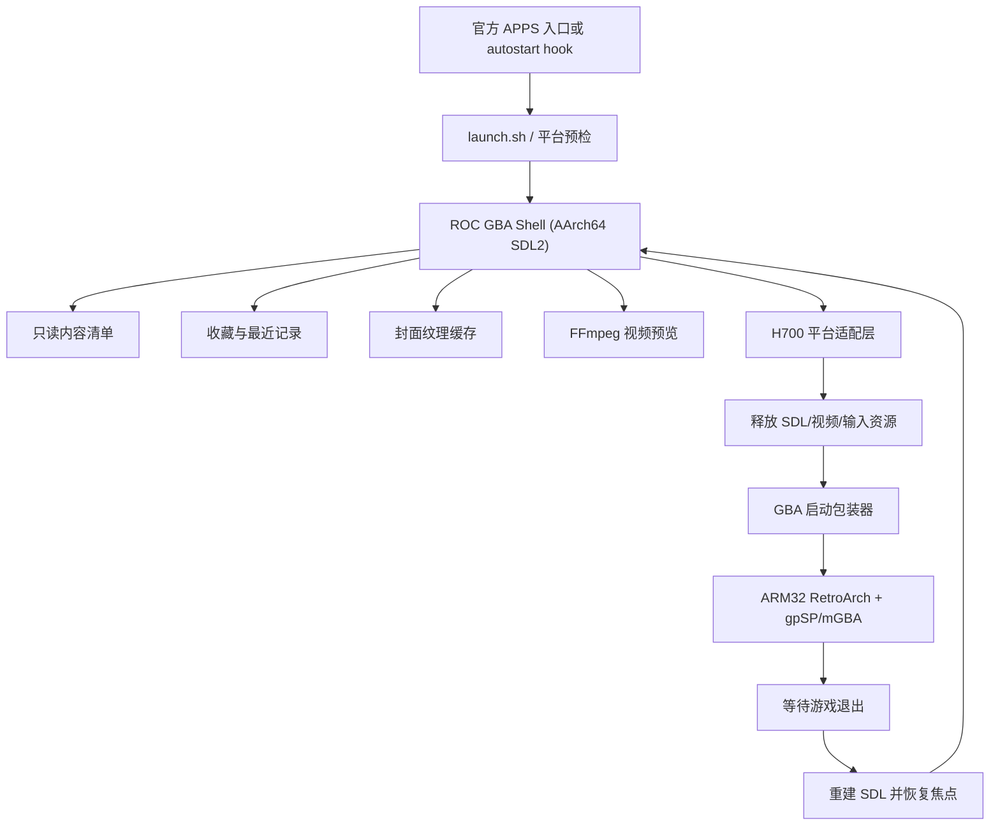

# RG34XXSP / H700 极简 GBA 前端实施规划

日期：2026-08-07  
目标设备：当前实机 RG34XXSP-class H700 原厂 Linux 系统  
目标形态：官方应用中心中的独立 APP，可选开机自动进入，仅管理并启动应用内容包内的 GBA 游戏

## 1. 结论

推荐方案不是移植完整的 Pegasus（天马 G）Qt/QML 运行时，而是：

> 以现有 ROC AArch64 SDL2 前端骨架为基础，制作一个固定功能的 GBA Shell；复用 Pegasus 的元数据字段、内容组织方式、收藏/最近游戏语义和界面布局思想，但不携带通用主题引擎、通用平台扫描器和完整设置系统。

开机入口需要区分两个层级：兼容模式可挂在现有 `loadapp.sh -> autostart` 上，实机上该位置约在内核启动后的 9.86 秒；快速模式则要安装独立的早期启动服务。根据最新需求，首版默认采用正常启动链兼容模式，优先保留双卡挂载、网络/蓝牙、全部按键和官方电源行为，不为压缩数秒修改系统服务编排。快速模式保留为后续可选研究项，不进入首版用户设置。

这条路线最符合本项目的真实边界：

- 设备只有 720x480 内屏、约 973 MiB 内存且无 swap。
- 原厂内核明确为 `CONFIG_DRM=n`，没有 `/dev/dri`、X11 或 Wayland。
- 显示链是厂商 `/dev/fb0 + /dev/disp + /dev/ion + /dev/mali0`，不能把普通 Linux Qt EGLFS/KMS 包直接放上去运行。
- 厂商 SDL2 已有非上游 `mali` fbdev 后端；当前仓库也已经有 AArch64 SDL2 应用包、输入、布局和资源加载骨架。
- 本产品只有四个视图和两个设置项。完整 Pegasus 的 provider、主题切换、Qt Multimedia、SQL、SVG 和大量 QML 运行时不会带来对应收益。
- 无论是否采用 Pegasus，用户要求的“左侧视频和介绍、右侧封面列表”都要重做专用 720x480 界面；Pegasus 默认 Grid 主题并不是该布局。

若直接复制或修改 Pegasus GPLv3 源码，分发的派生程序需要遵守 GPLv3。若只兼容其公开元数据格式并独立实现固定 UI，则可以让本项目保持自己的代码边界，但仍要分别核对字体、封面、视频、ROM、BIOS 和主题素材的授权。

## 2. 已确认的实机约束

| 项目 | 实机事实 | 对实现的影响 |
|---|---|---|
| CPU / ABI | H700，4x Cortex-A53，系统为 AArch64 | 前端使用 AArch64；现有 GBA 核心是 ARM32，二者可作为独立进程共存 |
| 内存 | 约 973 MiB，无 swap | 图片必须按显示尺寸解码；视频只保留少量帧；禁止全库预加载 |
| LCD | 720x480，横向 | 直接制作固定基准布局，不套用 Android 高分辨率主题 |
| 显示 | 无 DRM/KMS；Sunxi fb/disp/ion + vendor Mali | 首选厂商 SDL2 `mali`；必须验证显示独占和退出恢复 |
| 输入 | `/dev/input/event1` 为 `ANBERNIC-keys`，另有 `/dev/input/js0` | 使用 SDL GameController/evdev，按设备 GUID 固定映射 |
| 电源 | AXP2202，另有第三方 `/mnt/mod/ctrl/pwr_new.sh` | 新进程目前不被电源脚本识别，关机/合盖必须专项适配 |
| 启动链 | `/mnt/vendor/ctrl/loadapp.sh` 在官方菜单前调用 `/mnt/mod/ctrl/autostart` | 可用前台 hook 阻塞官方菜单，实现可撤销的自动进入 |
| 当前冷启动 | 内核 2.358 秒，用户态到 `graphical.target` 8.777 秒，总计 11.136 秒 | 单纯 APP 自启不能实现整机 3 秒冷启动 |
| 进程启动点 | `launcher.sh` 约 4.70 秒，`loadapp.sh` 约 4.87 秒，`dmenu_ln/muos1.bin` 约 9.86 秒 | 约 5 秒消耗在挂载、网络/蓝牙重启、第三方 autostart 等初始化中 |
| APP 入口 | `/mnt/mmc/Roms/APPS/<name>.sh` 调用同目录应用包 | 可保持标准 APPS 包结构，不替换官方系统文件 |
| 可用空间 | `/mnt/mmc` 探测时只余约 233 MiB | 程序入口可放 TF1；ROM、封面和视频优先放 TF2 内容包 |

当前唯一尚未完成、且必须最先完成的硬件验证是：从官方 APPS 入口启动时，原厂菜单是否会完整释放 fb/disp/ion/input/ALSA，以及退出本前端后官方菜单能否可靠恢复。此前 `mali-fbdev: Can't create EGL window surface` 出现在原前端仍占用显示的场景，不能据此断言厂商 SDL 后端不可用，也不能把它当成已经解决。

## 3. 产品边界

### 3.1 用户可见功能

顶部固定四栏：

1. `最近游戏`：按 `lastPlayed` 倒序，未启动过的游戏不显示。
2. `GBA`：普通 GBA 内容目录中的全部游戏。
3. `GBA改版`：改版内容目录中的全部游戏。
4. `收藏`：`favorite=true` 的游戏。

主界面固定为：

- 左侧：当前游戏的视频预览。
- 左侧视频下方：游戏标题和文字介绍。
- 右侧：封面列表或网格，焦点封面清晰高亮。
- 顶部右侧：24 小时时钟、充电状态和电池百分比。
- 设置页：只保留“返回官方系统”、“开机自动进入本前端”和“屏幕亮度”。
- 音量：只使用物理音量键调整，显示短时数字提示，不在设置页重复提供音量项。

### 3.2 明确不实现

- 不扫描官方系统的 GBA ROM 目录。
- 不提供路径、核心、画面比例、滤镜、语言、主题、下载源等通用设置。
- 不提供其他平台、模拟器或文件浏览器入口。
- 不提供设备端刮削；封面、介绍和视频均在 PC 端预处理。
- 不在设备端修改 ROM，也不自动下载 BIOS。
- 不支持运行时主题切换；所有尺寸和效果针对 720x480 固化。

“GBA”和“GBA改版”是内容分类，不是两套模拟器。每个游戏可以在制作清单中声明隐藏的核心覆盖，但该选项不进入用户设置。

## 4. 技术路线取舍

| 路线 | 优点 | 主要问题 | 结论 |
|---|---|---|---|
| 完整 Pegasus + Qt EGLFS | 保留 QML 和主题生态 | 本机无 DRM；需要定制 Qt EGLFS fbdev/vendor EGL；Qt Multimedia 视频仍要解决 | 不作为产品主线 |
| Pegasus + Qt linuxfb 软件渲染 | 可较快证明 QML 能显示 | 动画、缩放、视频和内存风险高；仍要打包大量 Qt | 只作为技术备选 PoC |
| AArch64 SDL2 固定前端 + Pegasus 数据兼容 | 包小、启动快、显示和输入更贴近原厂栈；功能边界可控 | 需要自行实现 UI 和视频管线 | 推荐产品路线 |

如果项目必须在法律和产品描述上称为“Pegasus fork”，应单独安排一个两周以内的 Qt 5.15 `linuxfb + QT_QUICK_BACKEND=software` PoC。PoC 只有在静态 UI、视频、输入、RA 切换和 20 次恢复都通过后，才值得继续。不能先投入完整主题裁剪，再发现底层显示/视频不可用。

## 5. 推荐软件架构



建议模块边界：

| 模块 | 职责 |
|---|---|
| `AppController` | 浏览、启动、返回、退出的顶层状态机 |
| `ContentCatalog` | 读取包内清单，只建立 GBA/GBA改版两个基础集合 |
| `ViewModel` | 派生最近、收藏、当前分类及排序，不复制游戏对象 |
| `StateStore` | 原子保存收藏、最后启动时间、游玩次数和最后焦点 |
| `CoverCache` | 按显示尺寸解码，LRU 缓存当前页及前后少量封面 |
| `PreviewPlayer` | 延迟启动、静音循环、滚动时停止的视频解码器 |
| `GameLauncher` | 校验白名单路径、释放 UI、以 argv 启动包装器并等待 |
| `H700Platform` | SDL driver、输入映射、显示恢复、挂起/关机、HDMI/翻盖适配 |
| `BootIntegration` | 幂等安装/移除 autostart hook，只切换 marker 文件 |

前端主进程只解析应用自己的内容根。所有传给启动器的 ROM 路径必须经过 `realpath()`，并确认仍位于允许的 `content/roms/gba` 或 `content/roms/gba_hacks` 下，避免元数据把任意系统命令或系统 ROM 引入前端。

## 6. 720x480 界面规格

早期曾检查外部 Pegasus 配置包，其 `settings.txt` 选择 `themes/pegasusG-Grid/`。该主题具备最近、收藏、集合、网格、视频预览和文字介绍逻辑，是本项目 UI 的历史参考；外部配置包不纳入公开仓库。

现有 960x640 配置很适合 720x480。两者都是严格的 3:2，横纵缩放因子均为 `0.75`，因此不会产生裁切或非等比拉伸：

```text
uiScale = framebufferWidth / 960 = 720 / 960 = 0.75
expectedHeight = 640 * 0.75 = 480
```

Pegasus 全局 `vpx()` 实际以 1280x720 为基准：960x640 的 `winScale` 是 0.75，720x480 的 `winScale` 是 0.5625，两者之比正好为 0.75。Grid 主题同时大量使用父元素比例布局，所以在 Pegasus 中已经会自动等比缩放，不需要逐项手改坐标。字体和 1px 边框仍应在 720x480 真机上做像素取整检查。

覆盖包不是可直接整体放入掌机的最小包：所有主题本体合计很小，但 `themes/Resource` 约 909 MiB，并包含大量背景视频、音乐和其他平台资源。首版只复制 `pegasusG-Grid`、实际字体、GBA 所需图标和当前选定资源，删除主题设置、背景音乐、动态背景、其他主题及其他平台素材。

许可方面，Grid 的 README 标注 CC BY-NC-SA 4.0，Pegasus 本体为 GPLv3，公共资源的授权还不统一。若项目会销售或随商业硬件分发，不能直接把当前 Grid 和资源包作为商用资产，必须取得作者额外授权或重做视觉资产。

建议使用真实像素布局，不按视口宽度缩放字体：

| 区域 | 建议尺寸 | 内容 |
|---|---:|---|
| 顶部导航 | `720x48` | 四个固定页签；L1/R1 或左右切换 |
| 左栏 | `292x432` | 视频 `280x158`，其下标题、描述和少量状态 |
| 中间间距 | `12` | 防止封面焦点与左栏相碰 |
| 右栏 | `416x432` | 3 列封面；可先用 2 列做可读性 A/B 测试 |

交互建议：

| 输入 | 行为 |
|---|---|
| D-pad | 封面移动；在顶部获得焦点时切换页签 |
| L1 / R1 | 直接切换四个页签 |
| A | 立即启动焦点游戏 |
| B | 从设置返回主界面；主界面不直接退出，避免误触回官方系统 |
| X | 收藏/取消收藏，并立刻原子落盘 |
| Start | 可与 A 同义，或不绑定；P0 后按实机手感决定 |
| Menu | 打开三个项目的设置页 |
| Volume +/- | 调用 H700 音量平台层，显示 `0..9` 数字提示约 1.2 秒 |
| Power / lid | 不映射为普通 UI 按键；交给官方 power helper 和挂起状态机 |

视频行为对性能影响最大，应固定为：

- 焦点稳定 300 ms 后才开始解码；连续滚动期间不打开视频文件。
- 切换游戏时先显示静态占位图，旧视频线程必须可取消并及时回收。
- 默认静音循环，避免与官方 ALSA 和 RA 抢占，也避免列表滚动产生声音跳变。
- 素材建议 H.264 Baseline、YUV420p、`426x240` 或 `320x240`、24/30 fps、低码率、3 至 10 秒。
- 解码输出直接上传 SDL YUV texture；只保留 2 至 3 帧队列，不做全视频缓存。
- 首版使用 AArch64 FFmpeg/libavcodec 软件解码。H700 的 Cedar/VPU 可以后续研究，但不应成为首版依赖。

封面在 PC 端统一转成目标尺寸附近的 WebP/JPEG/PNG。不要在 973 MiB 无 swap 的设备上把原始 4K 封面全部解码入内存。

## 7. 内容包与数据模型

### 7.1 推荐目录

逻辑上保持一个自包含 payload；实际可把大内容放在 TF2：

```text
/mnt/mmc/Roms/APPS/ROCGBA.sh
/mnt/mmc/Roms/APPS/ROCGBA/
  launch.sh
  bin/roc_gba_frontend
  lib/
  assets/fonts/
  assets/ui/
  config/app.ini
  scripts/launch-gba.sh
  scripts/install-boot-hook.sh
  scripts/uninstall-boot-hook.sh

/mnt/sdcard/ROCGBA/content/
  manifest.json
  metadata.pegasus.txt
  roms/gba/*.gba
  roms/gba_hacks/*.gba
  media/<game-id>/cover.webp
  media/<game-id>/preview.mp4
  media/<game-id>/fallback.webp

/mnt/data/rocgba/
  state.json
  autostart.enabled
  logs/
  retroarch/
    retroarch.cfg
    saves/
    states/
    screenshots/
```

卡 1 和卡 2 都作为合法内容来源，但仍只扫描本应用自己的白名单目录：

```text
/mnt/mmc/Roms/APPS/ROCGBA/content/    # 卡 1
/mnt/sdcard/ROCGBA/content/          # 卡 2
```

正常启动链会在 autostart 之前挂载卡 1 `/mnt/mmc`、数据分区 `/mnt/data`，并通过 `mmc_new.sh add` 挂载卡 2 `/mnt/sdcard`，所以双卡识别不需要延迟前端首屏。两个根分别读取自己的 manifest 后合并：ID 冲突时默认卡 2 覆盖卡 1，日志记录冲突；收藏、最近、存档和设置始终写 `/mnt/data/rocgba`，不跟随可拔卡移动。

运行时检测 `/proc/mounts` 或 mountinfo 变化。卡 2 拔出时立即停止对应视频、释放文件句柄并把条目标为不可用；重新插入后只重载卡 2 manifest，不重新扫描整库。若最终内容很小，也可以只使用卡 1 APP 目录。

### 7.2 清单策略

为了最快冷启动，PC 打包阶段生成 `manifest.json`，设备端不递归扫描整张卡。Pegasus 的 `metadata.pegasus.txt` 同时保留，作为制作工具和未来桌面版兼容格式；设备运行时优先读编译后的清单。

建议每项至少包含：

```json
{
  "id": "metroid-fusion-usa",
  "title": "Metroid Fusion",
  "group": "gba",
  "rom": "roms/gba/Metroid Fusion.gba",
  "cover": "media/metroid-fusion-usa/cover.webp",
  "preview": "media/metroid-fusion-usa/preview.mp4",
  "description": "...",
  "core": "gpsp"
}
```

约束：

- `group` 只接受 `gba` 或 `gba_hacks`。
- `rom` 只接受相对路径和白名单扩展名，禁止 `..`、绝对路径和 shell 片段。
- `core` 只接受 `gpsp` 或 `mgba`，默认 `gpsp`。
- 收藏、最近和游玩次数不写回只读内容清单，而写入 `/mnt/data/rocgba/state.json`。
- 状态文件按 `write temp -> fsync -> rename -> fsync directory` 原子更新，避免突然断电留下半个 JSON。
- 游戏 ID 在重新打包后必须稳定；不能仅以展示标题为主键。

## 8. RetroArch / GBA 启动方案

### 8.1 ABI 选择

实机已有：

- `/mnt/vendor/deep/retro/retroarch`：ARM32 hard-float。
- `/mnt/vendor/deep/retro/retroarch64`：AArch64。
- `gpsp_libretro.so`、`mgba_libretro.so`、`vba_next_libretro.so`、`vbam_libretro.so`：全部是 ARM32。

因此首版必须使用 ARM32 `/mnt/vendor/deep/retro/retroarch`。不能让 AArch64 `retroarch64` 加载 ARM32 `.so`。AArch64 前端通过独立子进程启动 ARM32 RetroArch，不存在进程内 ABI 冲突。

### 8.2 核心策略

- 默认：`gpsp_libretro.so`，目标是最低启动和运行负担。
- 兼容回退：`mgba_libretro.so`，用于 gpSP 不兼容的游戏或改版。
- 包作者可在 `manifest.json` 中逐游戏指定 mGBA；用户界面不出现核心选择。
- gpSP 依赖 `gba_bios.bin`。设备已有 `/mnt/vendor/bin/game/gba/gba_bios.bin`，首版引用设备文件；不要在未确认授权时随包分发 BIOS。

### 8.3 两级启动策略

产品首个可用版本先走官方/mod 包装器：

```sh
/mnt/mod/ctrl/RA_launch.sh \
  gpsp_libretro.so \
  "/mnt/sdcard/ROCGBA/content/roms/gba/example.gba"
```

它已经处理机型、热键、音量、shader、存档及部分电源逻辑，能降低首轮兼容风险。但该脚本约 900 行，会按全局设置修改 `/.config/retroarch/retroarch.cfg`，不适合作为最终“最快启动”路径。

在显示、输入和退出恢复通过后，实现应用专用的 `launch-gba.sh`：

```sh
/mnt/vendor/deep/retro/retroarch \
  -c /mnt/data/rocgba/retroarch/retroarch.cfg \
  -L /mnt/vendor/deep/retro/cores/gpsp_libretro.so \
  "/mnt/sdcard/ROCGBA/content/roms/gba/example.gba"
```

专用配置从实机厂商配置抽取并固定：

- `video_driver = "gl"`
- `audio_driver = "alsathread"`
- `input_driver = "udev"`
- `system_directory` 指向已有 GBA BIOS 目录
- `savefile_directory`、`savestate_directory`、截图目录全部指向 `/mnt/data/rocgba/retroarch/`
- 关闭菜单启动、网络、成就、自动扫描、缩略图、shader 和不必要 overlay
- 保留官方已验证的退出热键和输入映射

不能一开始就凭空生成一份极小 RA 配置。正确做法是先复制实机当前可工作的配置，在专属路径上逐项删除并做 A/B 启动计时，直至得到最小集合。

### 8.4 前端与模拟器切换状态机

点击封面后必须执行：

1. 原子记录 `lastPlayed`、`playCount` 和当前焦点。
2. 停止并 join 视频线程，销毁视频 texture。
3. 销毁封面 texture、SDL renderer/window，关闭 game controller 和 SDL audio/video 子系统。
4. 用 `fork/execve` 或 `posix_spawn` 传递 argv，禁止拼接 shell 命令。
5. 前台等待 RetroArch 退出；保存退出码和耗时。
6. 重新初始化厂商 SDL `mali` 后端、输入和 renderer。
7. 重新载入当前页可见封面，恢复到启动前的分类和游戏。
8. 若重建失败，写日志并退出，让官方启动链接管，而不是黑屏循环重试。

验收线是连续启动/退出同一游戏 20 次，无黑屏、无重复按键、无声音设备占用、无持续内存增长。

## 9. 官方 APPS 与开机自动进入

### 9.1 应用中心入口

沿用已确认的标准形态：

```text
/mnt/mmc/Roms/APPS/ROCGBA.sh
  -> exec /mnt/mmc/Roms/APPS/ROCGBA/launch.sh
  -> 平台预检
  -> exec bin/roc_gba_frontend
```

`launch.sh` 必须先检查：二进制、内容清单、ROM 根、厂商 SDL、RA 和目标核心是否存在。任何一项缺失都应记录日志并返回官方菜单，不能停在空白 framebuffer。

### 9.2 自启 hook

`/mnt/vendor/ctrl/loadapp.sh` 会在进入 `dmenu_ln` 循环前调用 `/mnt/mod/ctrl/autostart`。当前 `autostart` 已属于第三方 mod 且包含其他初始化，因此禁止覆盖它。

安装器只在现有脚本尾部添加一次带标记的块：

```sh
# BEGIN ROCGBA AUTOSTART
if [ -f /mnt/data/rocgba/autostart.enabled ] && \
   [ -x /mnt/mmc/Roms/APPS/ROCGBA/launch.sh ]; then
    /mnt/mmc/Roms/APPS/ROCGBA/launch.sh --autostart
fi
# END ROCGBA AUTOSTART
```

规则：

- 安装前备份原文件并记录哈希；重复安装不得产生第二个块。
- UI 中打开开关只创建 `autostart.enabled`，关闭只原子删除 marker，不反复编辑脚本。
- 前端以前台方式运行。只要它不退出，`loadapp.sh` 就不会继续进入官方菜单。
- “返回官方系统”应先停止预览、保存状态、释放 SDL，然后正常退出；hook 返回后 `loadapp.sh` 自然启动官方 `dmenu_ln`。
- APP 崩溃或依赖缺失时，hook 立即返回并进入官方系统，禁止自启重试循环。
- TF2 内容卡缺失时同样直接回官方系统。
- 卸载器只移除 BEGIN/END 之间的本应用块；若外部已修改脚本，禁止用旧备份覆盖整个文件。

不使用 `/mnt/mod/.last`，因为它是“启动上次游戏”机制，不是第三方前端的开机入口。

该 hook 现在是首版默认方案。实机进程时间显示它在 `loadapp.sh` 的挂载、NetworkManager/蓝牙重启、TF2 挂载之后执行，约在内核启动后的 9.86 秒。轻量前端预计再用 0.5 至 1.5 秒完成首屏，因此目标是 Linux 内核起点后 10 至 12 秒可操作；`systemd-analyze` 不统计 U-Boot，按下电源键到界面先按约 12 至 15 秒规划，最终以冷启动录像或串口 GPIO 时间戳为准。

第一次从 APPS 成功启动并完成基本自检后，默认创建 `autostart.enabled`。用户关闭自启时只删除 marker；下次开机恢复官方菜单。前端崩溃、内容清单损坏或两张卡都没有内容时，hook 返回并继续官方菜单。

### 9.3 后续可选快速模式

快速模式不进入首版。只有正常启动链版本完成“前端 -> RA -> 前端 -> 官方系统”、双卡和盒盖验收后，才考虑提供独立实验安装包。安装动作建议一次性完成：

1. 把最小前端二进制、字体和首屏必要资源安装到 rootfs 的固定只读运行目录，避免等待 FAT/exFAT 内容卡后才能画出首屏。
2. 安装 `rocgba-fastboot.service` 和一个很小的挂载/预检 helper；服务早于 `launcher.service` 获得显示，但不得与官方菜单同时运行。
3. 使用 rootfs 上的 marker 决定是否进入快速模式，因为 `/mnt/data` 在早期阶段尚未挂载；UI 开关同时更新 rootfs marker 和 `/mnt/data` 中的镜像状态。
4. 快速模式先显示缓存的首屏，同时并行挂载 `/mnt/vendor`、`/mnt/mmc`、`/mnt/data` 和 TF2，并准备 RetroArch/ROM；内容未就绪时焦点可移动，但暂不接受启动游戏。
5. Wi-Fi、蓝牙、SSH、更新扫描和官方主题初始化全部延后；前端本身不依赖网络。需要这些服务时可在首屏出现后后台启动。
6. 用户选择“返回官方系统”时，前端释放显示，再启动原厂 `loadapp.sh` 的剩余初始化和 `dmenu_ln`，而不是自己仿制官方菜单。
7. 快速服务崩溃、marker 损坏、内容卡缺失或依赖超时，必须取消显示占用并自动回落到原厂 `launcher.service`。

不能直接 mask/disable 一批系统服务来追求数字。应先用独立 fastboot target 做可恢复 A/B 测试，并保留拔卡或 SSH 删除 marker 后恢复官方启动链的救援路径。

以当前数据评估：

| 模式 | 合理目标 | 说明 |
|---|---:|---|
| 现有 `autostart` 兼容模式 | 约 9 至 11 秒进入前端 | 改动最小，基本保持原厂启动顺序 |
| 早期服务快速模式 | 约 4.5 至 6 秒进入可操作前端 | 需要调整系统启动编排，必须真机计时 |
| 冷启动 3 秒 | 当前原厂栈不可承诺 | 内核已占 2.358 秒，尚未计入 bootloader；需固件级优化 |
| 开盖恢复 | 目标小于 1 秒 | 最符合本机日常“3 秒内可玩”的实现方式 |

### 9.4 电源和翻盖

当前第三方 `pwr_new.sh` 只识别 `retroarch`、`dmenu.bin` 和 `muos.bin`。运行 `roc_gba_frontend` 时它会落入通用 `sleep` 分支，某些电源键配置下只能挂起而不能关机。

实机二进制和脚本还确认了两点：

- 官方 `muos1.bin` 内含 `hallkey`、`os_sleep` 和 `/mnt/vendor/ctrl/pwr_new.sh` 调用路径。
- 三个厂商 RetroArch 二进制都内含 `/mnt/vendor/ctrl/pwr_new.sh` 路径。直接启动同一个 ARM32 RetroArch 并不会丢失官方游戏内的电源处理。

因此“盒盖待机、开盖继续当前 GBA 游戏”在架构上可保留，且不要求 RA 退出或重新载入存档。仍需做真实合盖测试确认唤醒源、音频、Mali surface 和手柄状态都能恢复。前端浏览状态下应在调用官方 power helper 前暂停视频和音频；`echo mem` 返回后重新枚举输入并在 EGL context 丢失时重建 renderer。

该问题列为发布阻断项。优先方案是在本应用的平台层处理自己的安全退出和状态落盘，并通过带标记、可卸载的兼容块让 `pwr_new.sh` 识别 `roc_gba_frontend`。任何修改都不得覆盖已有 mod 脚本。还要实测：

- 短按电源键挂起/唤醒。
- 长按或配置指定动作下安全关机。
- 合盖 `hallkey` 变化时停止视频、释放音频并挂起。
- 唤醒后重建 SDL renderer 和视频 decoder。
- 游戏运行时继续沿用 RetroArch 已有电源处理。

### 9.5 状态栏、亮度和音量

顶部右侧状态栏由 H700 平台层提供，不依赖主题直接访问任意系统文件：

- 时间：每分钟更新一次 `%H:%M`。当前样机系统时间仍停在 2022-04-14、时区 UTC、NTP 未启用，因此 UI 能显示时钟但初始值不可信。首版应启用轻量 NTP 校时，并在离线时使用校准后的 `rtc0`；不能把联网成功作为进入前端的前置条件。
- 电池：读取 `capacity`、`status`、`present` 和 USB `online`。实机当前为 91%、Charging；百分比建议每 10 秒刷新，充电图标可更快刷新，但不需要 60 fps 轮询 sysfs。
- 亮度：实机通过 `/sys/class/power_supply/axp2202-battery/brightness`，当前值为 7，系统没有标准 `/sys/class/backlight`。写入范围尚未做行为测试，发布前要逐级校准最小/最大值、黑屏保护、持久化和唤醒恢复，再把它映射成设置页 slider。
- 音量：主按键设备暴露音量键码 `0x72/0x73`，第三方系统已有 ARM32 `volumeCtrl.dge` 和 `openbor_volume` 0..9 资源。前端优先自己接管物理音量事件、复用官方逻辑级别，并绘制数字 OSD；不要同时运行一个会再次打开 framebuffer 的 SDL1.2 OSD，避免双重响应和显示冲突。

启动 RetroArch 后，前端关闭自己的输入和 OSD，厂商 RetroArch 继续处理游戏中的音量、电源和盒盖；返回前端后重新读取实际音量与亮度，防止显示旧值。

## 10. 性能预算

建议产品目标：

| 指标 | 目标 |
|---|---:|
| 前端进程启动到可操作 UI | 小于 1 秒，不包含整机 bootloader/内核启动 |
| 整机冷启动到前端 | 内核起点后 10 至 12 秒；含 U-Boot 的按键到界面估计 12 至 15 秒 |
| A 键到 RA 首帧 | 复用包装器时先测基线；专用 wrapper 目标小于 2 秒 |
| 开盖到恢复画面/声音 | 小于 1 秒，必要时允许画面先于声音恢复 |
| 输入响应 | 小于 50 ms，无滚动队列拖尾 |
| 前端常驻 RSS | 静态 UI 小于 100 MiB；视频播放小于 180 MiB |
| 封面缓存 | 当前页 + 前后各一页，设硬上限 |
| 视频队列 | 2 至 3 帧 |
| 返回前端 | RA 退出后 1 秒内恢复可操作 |
| 稳定性 | 20 次启动/退出；4 小时浏览/预览无崩溃和持续增长 |

这些是验收目标，不是现有实测值。每个阶段都要在设备上记录单调时钟、RSS、文件打开数和退出码。

## 11. 实施阶段

### P0：显示所有权与 RA 往返，发布阻断

交付物：

- 官方 APPS 入口启动的最小 SDL 720x480 画面。
- 完整 H700 按键表和 SDL mapping。
- 先通过 `RA_launch.sh` 启动一个包内 GBA ROM。
- 前端 `Release -> Launch -> Reacquire` 状态机。
- 20 次 RA 往返日志。

通过条件：从应用中心进入、能操作、能启动 gpSP、能退出回前端、能从前端回官方系统。若厂商 `mali` 在官方 APPS 生命周期中仍不能创建 surface，立即转为直接 fbdev renderer PoC；此时不要开始视频功能。

### P1：固定 GBA UI 与持久状态

交付物：

- 720x480 专用布局和四个固定页签。
- 打包期 manifest 生成器与设备端只读解析器。
- 封面 LRU、占位图和损坏资源降级。
- 收藏、最近、游玩次数和最后焦点的原子持久化。
- gpSP 默认、mGBA 逐游戏覆盖。
- 卡 1/卡 2 manifest 合并、热拔出降级和重插重载。
- 顶部时钟、电池/充电状态、亮度 slider 和物理音量数字 OSD。

通过条件：只显示 payload 内 ROM；拔掉 TF2 或损坏一张封面不会黑屏；突然断电后状态文件仍可读取。

### P2：视频预览与启动提速

交付物：

- AArch64 FFmpeg 精简构建和许可证清单。
- 300 ms 延迟、静音循环、可取消解码、YUV texture 渲染。
- 应用专用 RA 配置和精简 wrapper。
- `RA_launch.sh` 与精简 wrapper 的启动耗时/兼容性对比。

通过条件：快速滚动无明显卡顿；视频播放时 RSS 在预算内；RA 首帧和返回时间达到目标；gpSP 不兼容条目按清单回退 mGBA。

### P3：自启、返回官方系统和故障回退

交付物：

- 幂等 autostart hook 安装/卸载器。
- 设置页的“返回官方系统”、“开机自动进入”和“屏幕亮度”。
- 启动前依赖预检、崩溃回官方系统、日志轮转。
- APP 更新时保留状态、存档和 marker。

通过条件：开关各测试 10 次；记录按电源键、内核起点、前端首帧和可操作时刻；内容卡缺失、二进制损坏和前端崩溃都能进入官方菜单；不破坏现有 `/mnt/mod/ctrl/autostart` 其他逻辑。

### P4：掌机系统行为与发布测试

交付物：

- `pwr_new.sh` 兼容方案或等价平台处理。
- 电源键、合盖、唤醒、HDMI、耳机、低电量测试。
- 4 小时 soak、50 次冷启动、50 次游戏往返。
- 安装、升级、卸载和恢复说明。
- GPL/LGPL/素材/ROM/BIOS 授权清单和对应源代码交付包。

通过条件：不存在无法退出的黑屏路径；所有系统脚本改动都有 marker、备份、幂等安装和非破坏性卸载。

## 12. 建议的首版默认决策

为了避免把已删除的设置项转移成开发期反复争论，首版直接固定：

- 产品实现：AArch64 SDL2 固定前端，不运行完整 Pegasus。
- 数据兼容：保留 `metadata.pegasus.txt`，设备优先读取生成后的 manifest。
- 视频：H.264 Baseline 426x240、静音、焦点稳定 300 ms 后播放。
- 列表：右侧 3 列；实机可读性不达标再退为 2 列，不做用户选项。
- 核心：gpSP 默认，mGBA 按游戏清单回退。
- RA：P0 复用 `RA_launch.sh`，P2 经对比后切到专用配置和 wrapper。
- 存档：应用专属目录，不污染官方全局存档；更新和卸载默认保留。
- 自启：marker 控制；正常退出即回官方系统；失败只尝试一次并自动回官方系统。
- 首次成功运行后：默认打开正常链路自启；关闭后恢复完整官方启动链。快速启动服务不进入首版。
- 内容：只信任应用 payload 根，不扫描 `/mnt/mmc/Roms/GBA` 等官方目录。

## 13. 第一轮开发顺序

第一轮不要先画完整主题。建议按以下顺序执行：

1. 在维护窗口从官方 APPS 真实启动最小 SDL `mali` 程序，确认 dmenu 的显示释放行为。
2. 补齐所有按键的按下/释放值和 SDL GUID mapping。
3. 用一个合法测试 ROM 经 `RA_launch.sh + gpsp` 完成首次往返。
4. 将 UI 缩减成一页静态封面列表，连续往返 20 次。
5. 再接 manifest、四分类、收藏和最近。
6. 最后接视频、自启和电源/翻盖适配。

P0 通过后，这个项目的主要风险会从“平台能否工作”降为常规前端工程；P0 之前，任何完整主题和素材工作都应保持可替换，避免把时间压在尚未成立的显示链上。

## 14. 依据

- [实机系统与硬件基线](./RG34XXSP_H700_SYSTEM_HARDWARE_BASELINE.md)
- [Pegasus 移植分析](./PEGASUS_H700_PORTING_ANALYSIS.md)
- [H700 APP 工程基线](./P0_P1_H700_APP_BASELINE.md)
- 实机采集：私有设备采集目录中的 `gba-plan.txt`（公开仓库已排除）
- 实机采集：私有设备采集目录中的 `ra-launch.txt`（公开仓库已排除）
- Pegasus 上游：[mmatyas/pegasus-frontend](https://github.com/mmatyas/pegasus-frontend)
- 默认主题上游：[mmatyas/pegasus-theme-grid](https://github.com/mmatyas/pegasus-theme-grid)
