# ANBERNIC RG34XXSP / H700 Linux 系统与硬件开发基线

采集日期：2026-08-07（主机时间）  
目标设备：RG34XXSP H700 样机（局域网地址已移除）  
分析方式：SSH root 只读探测、运行进程检查、设备树与系统文件离线分析  
设备端操作约束：未安装软件、未修改配置、未停止前端、未重启或写入设备节点

## 1. 执行摘要

这台样机可明确归入 **ANBERNIC RG34XXSP 系列 H700 掌机**，不是抽象的通用 H700 开发板。关键证据是设备树 LCD 驱动名 `rg34xxsp_v1`。SoC 在厂商 BSP 中沿用 `sun50iw9` / `allwinner,h616` 身份，因此只按 `/proc/device-tree/model` 识别会误判成普通 H616 板。

对软件制作影响最大的结论如下：

1. CPU 和根文件系统均支持 AArch64，四核 Cortex-A53、约 973 MiB 可用内存，AArch64 应用可直接运行；系统还保留 armhf multiarch，以兼容原厂 32 位前端和模拟器。
2. 原厂内核是 Allwinner 4.9 BSP，明确为 `CONFIG_DRM=n`。运行时没有 `/dev/dri`，不能把 DRM/KMS、GBM、Panfrost、Wayland 或 X11 当作可用显示路径。
3. 内屏的实际显示栈是 `/dev/fb0 + /dev/disp + /dev/ion`；GPU 是 `/dev/mali0 + mali_kbase + 厂商 libmali`。安装了 Mesa/Panfrost 文件不代表它们可用。
4. 内屏模式为 `720x480@约59 Hz`、32 bpp、stride 2880；虚拟高度为 960，符合双缓冲页翻转布局。
5. 原厂前端直接持有 framebuffer、显示控制、ION、输入和 ALSA。新的全屏前端必须先解决显示所有权交接，不能与其并行抢占。
6. 厂商 SDL2 2.28.5 包含非上游 `mali` 视频后端，但现有 ROC 日志显示，在原前端仍占用显示时创建 `mali-fbdev` EGL surface 失败。KMSDRM、Wayland、X11、fbcon、DirectFB 在本机均不可用；offscreen 只能用于截图/测试。
7. 电源、亮度、翻盖、扬声器状态等控制被厂商塞进 AXP2202 battery sysfs 节点；它们不是标准 backlight API。应用应通过单独的平台适配层访问，不能散落硬编码。
8. 原系统默认以前端 root 进程运行，`/dev/disp` 和 `/dev/ion` 也是 root-only。开发样机可沿用，产品化必须补 udev/group 权限或受控 helper。
9. 天马 G / Pegasus 源码本身可编译为 AArch64，但在这套原厂固件上不是“编译即可运行”。最稳妥路线是复用其元数据/启动协议并保持 SDL/Framebuffer UI；完整 Qt Quick 版本要么定制 Qt linuxfb/EGLFS fbdev 与厂商 EGL，要么迁移到具备 DRM/Panfrost 的新固件。

## 2. 识别与置信度

| 项目 | 实机结果 | 置信度 |
|---|---|---|
| 产品族 | ANBERNIC RG34XXSP-class | 高：`lcd_driver_name=rg34xxsp_v1` |
| SoC | Allwinner H700，厂商 BSP 标识为 H616/sun50iw9p1 | 高 |
| DT model | `sun50iw9` | 实测 |
| DT compatible | `allwinner,h616`, `arm,sun50iw9p1` | 实测 |
| 主机名 | `ANBERNIC` | 实测 |
| 序列号 | DT serial-number 为空；bootargs 含厂商序列字段 | 实测 |

报告中的“RG34XXSP”指当前 LCD/机型适配变体，不应自动推广到 RG35XX、RG40XX、RG CubeXX 等所有 H700 设备。跨机型至少要重新探测面板、分辨率/旋转、按键 GPIO、音频路由、翻盖开关和电池属性。

## 3. 启动链与基础软件

```mermaid
flowchart LR
    A["Boot ROM / SPL"] --> B["U-Boot 2018.05"]
    B --> C["Linux 4.9.170 vendor BSP"]
    C --> D["systemd 249 / Ubuntu 22.04 userland"]
    D --> E["launcher.service"]
    E --> F["/etc/init.d/launcher.sh"]
    F --> G["/mnt/vendor/ctrl/loadapp.sh"]
    G --> H["/mnt/vendor/ctrl/dmenu_ln"]
    H --> I["/mnt/vendor/bin/muos1.bin"]
    I --> J["fb0 + disp + ion + input + ALSA"]
```



| 层 | 版本/状态 |
|---|---|
| Bootloader | U-Boot `2018.05`，bootargs 记录构建时间 2026-06-24 |
| Kernel | `4.9.170 #2 SMP PREEMPT`，AArch64，厂商 out-of-tree BSP |
| Userland | Ubuntu 22.04 LTS，glibc 2.35 |
| Init | systemd 249.11 |
| ABI | arm64 主系统，同时安装 armhf 库和动态加载器 |
| 编译工具 | 设备上有 GCC/G++ 11.4；没有 CMake、qmake、Qt runtime 工具 |
| 安全机制 | bootargs `selinux=0`；AppArmor service 未实际加载；前端无 seccomp |

系统时间不可信。PCF8563 RTC 把系统时间设置到 2022 年，采集时仍显示 2022；日志排序、TLS、缓存失效和文件版本判断不得依赖设备 wall clock。应用日志应同时记录 monotonic time，联网后再由受控时间同步修正 RTC。

### 3.1 启动健康与已知 BSP 告警

| dmesg / systemd 现象 | 解释与开发影响 |
|---|---|
| `optee: api uid mismatch`，bootargs `secure_os_exist=0` | 当前没有可用 OP-TEE；密钥和 DRM 方案不能依赖 TEE |
| HDMI DDC pinctrl 获取失败，两个 HDMI supply 使用 dummy regulator | HDMI 设备和音频仍注册成功，但 EDID、热插拔和休眠恢复必须实测 |
| thermal sensor `avcc is not calibrated` | 温度趋势可用，绝对值不宜作为精密校准依据 |
| 若干 CPU OPP 被 regulator 拒绝 | 运行时 cpufreq 列表已过滤；应用只使用 sysfs 公布的频点 |
| `rtl8821cs` 初次 probe `-123`，之后 wlan0/wlan1 正常 | 属于厂商加载时序/重试现象；网络恢复仍需压力测试 |
| 前端启动时重复 `invalid bits_per_pixel: 8` / `invalid fmt` | 厂商 disp 像素格式转换存在兼容告警；新 framebuffer/EGL 后端需验证真实 bitfield |
| Realtek RF-K 在 site-survey 时反复报错 | 扫描期间的驱动日志噪声；若吞吐/稳定性异常再关联分析 |
| `systemd-binfmt.service` failed | 当前 systemd degraded 的已知原因，不阻塞 AArch64/armhf 原生 ELF |

本次日志中没有观察到 OOM、kernel panic、call trace 或存储 I/O error。上述告警是本固件启动基线，后续回归应比较“是否新增/频率是否恶化”，而不是仅检查日志里是否含 `error`。

## 4. CPU、内存与热管理

### 4.1 CPU

- 4 x ARM Cortex-A53 r0p4，ARMv8-A，支持 32/64 位执行。
- 指令特性：FP、ASIMD/NEON、AES、PMULL、SHA1、SHA2、CRC32。
- cpufreq 驱动：`cpufreq-dt`。
- 可用频点：480、720、936、1008、1104、1200、1320、1416、1512 MHz。
- 采集时 governor 为 `performance`，四核均在 1512 MHz。
- 原厂 `/mnt/vendor/ctrl/cpu_setting.sh` 支持 `performance`、`powersave`、`userspace 792 MHz` 和默认 `interactive`。

常驻 UI 不应长期强制 `performance`。建议空闲/菜单使用 `interactive` 或 `schedutil`，游戏启动时按核心配置切换，退出后恢复。频率控制属于平台服务，不应由每个应用各自写 sysfs。

### 4.2 内存

| 项目 | 数值 |
|---|---:|
| Linux 可见内存 | 996480 kB，约 973 MiB |
| CMA | 64 MiB |
| Swap | 无 |
| 采集时 MemAvailable | 约 822 MiB |
| 原厂前端 RSS/HWM | 约 51.5 MiB |

无 swap 意味着内存尖峰会直接触发 OOM。前端应设定明确预算：常驻 RSS 建议低于 120 MiB，图片缓存按分辨率和条目数做 LRU，ROM 扫描流式化，避免把 5k/10k 条目的封面或完整 XML DOM 一次性常驻。

### 4.3 温度

存在 CPU、GPU、VE、DDR、battery 五个 thermal zone，以及 CPU cpufreq 和 GPU devfreq 两个 cooling device。采集时 CPU/GPU/VE/DDR 约 61-64°C，电池约 30°C；当时 CPU 正处于持续 performance 模式。

## 5. 显示与 GPU

### 5.1 内核事实

- 内核配置：`# CONFIG_DRM is not set`、`CONFIG_FB=y`、`CONFIG_FB_CONSOLE_SUNXI=y`、`CONFIG_ION_SUNXI=y`。
- `/dev/dri` 和 `/sys/class/drm` 均不存在。
- 存在 `/dev/fb0`、`/dev/disp`、`/dev/ion`、`/dev/mali0`。
- Sunxi display 设备 compatible 为 `allwinner,sunxi-disp`。

因此以下判断必须写进所有构建与运行时决策：**安装 libdrm、GBM、Mesa、Panfrost DRI 文件，不等于内核提供 DRM。** 这台原厂固件上 KMSDRM/Panfrost 路径不可达。

### 5.2 Framebuffer 契约

| 属性 | 数值 |
|---|---:|
| 可见分辨率 | 720 x 480 |
| 模式 | `U:720x480p-59` |
| 像素深度 | 32 bpp |
| stride | 2880 bytes，即 720 x 4 |
| virtual size | 720 x 960 |
| rotate | 0 |
| pan | 0,0 |
| 权限 | `0660 root:video` |

虚拟高度为物理高度两倍，强烈表明两个 720x480 page。实现直接 framebuffer 后端时应先用 `FBIOGET_VSCREENINFO`/`FBIOGET_FSCREENINFO` 动态读取，按实际 bitfield 处理 ARGB/BGRA 顺序，再验证 `FBIOPAN_DISPLAY` 和 vsync ioctl；不能只按本次值硬编码。

原厂前端 `muos1.bin` 当前 mmap 了约 7 MiB `/dev/fb0`，并打开 `/dev/disp`、`/dev/ion` 及多个 dma-buf。它是显示所有者。新前端切入前必须让原前端退出并释放 FD，退出后再恢复系统前端或由 supervisor 重启。

### 5.3 GPU/EGL

- GPU 用户节点：`/dev/mali0`，权限 `0666`。
- 内核模块：out-of-tree `mali_kbase`。
- 用户库：AArch64 `/usr/lib/libmali.so.0.20.0`，同时有 armhf 版本。
- 库内标识：Mali-G31，OpenGL ES 3.2，驱动 `v1.r20p0-01rel0`。
- GPU devfreq：420/456/504/552/600/648 MHz，`simple_ondemand`，采集时 420 MHz。

这是 ARM proprietary Midgard/Bifrost 栈，不是 Mesa Panfrost。动态打包时必须让 `libEGL/libGLES` 与 `libmali`、`mali_kbase` 版本成套，不能从另一发行版随意携带 EGL/GBM。

### 5.4 SDL2 实测

系统存在至少两种 SDL2：

| 库 | 主要后端 | 实机含义 |
|---|---|---|
| Ubuntu 2.0.18 | KMSDRM、X11、Wayland 等 | 编译存在，但系统没有对应显示基础设施 |
| 厂商 SDL 2.28.5 | 非上游 `mali`、offscreen、evdev | `mali` 可能对接 fbdev EGL；offscreen 只适合测试 |

ROCFrontend 设备日志给出了直接证据：

- `mali`：`mali-fbdev: Can't create EGL window surface`；测试发生时原厂前端仍持有显示，不能据此判定后端永久不可用。
- `KMSDRM/kmsdrm`：不可用。
- `wayland`：不可用。
- `x11`：不可用。
- `fbcon`：SDL2 未编译该后端或不可用。
- `directfb`：不可用。
- `offscreen`：截图模式成功，但不输出到 LCD。

下一阶段允许干预设备时，最高优先级实验应是：受控停止原前端、单独运行最小 `SDL_VIDEODRIVER=mali` 窗口、验证内屏/输入/退出恢复。未经该实验，不能宣称 ROC 或 Pegasus 已完成真机显示。

### 5.5 HDMI

HDMI 使用厂商 Sunxi HDMI/disp 栈，不是 DRM connector。热插拔状态同时出现在：

```text
/sys/class/switch/hdmi/state
/sys/class/extcon/hdmi/state
```

采集时均为 `HDMI=0`。HDMI 音频走独立 ALSA card 2。原厂前端包含 `allen_lcd_hdmi_switch` 和 LCD/HDMI 双 framebuffer 逻辑，因此外接 HDMI 不是简单修改窗口尺寸；需把视频输出切换、音频路由、UI 分辨率与回切恢复作为一个事务。

## 6. 输入系统

### 6.1 设备

| 节点 | 名称 | 角色 |
|---|---|---|
| `/dev/input/event0` | `axp2202-pek` | PMIC 电源键 |
| `/dev/input/event1` | `ANBERNIC-keys` | 主游戏按键、D-pad、菜单、部分音量键 |
| `/dev/input/js0` | 同一主按键设备 | legacy joystick 接口 |
| `/dev/input/event2` | `dierct-keys-polled` | 直接/音量辅助键 |

主按键由 `gpio-keys-polled` 提供，轮询间隔 20 ms。应优先使用 evdev/SDL GameController，不要依赖 `/dev/input/event1` 编号恒定；按 `name`、`ID_PATH` 或 VID/PID/能力位匹配。

### 6.2 内核码表

| 物理键 | Linux code | 类型/值 |
|---|---:|---|
| D-pad Left / Right | `0x10` (`ABS_HAT0X`) | -1 / +1 |
| D-pad Up / Down | `0x11` (`ABS_HAT0Y`) | -1 / +1 |
| A | `0x130` (`BTN_SOUTH`) | key |
| B | `0x131` (`BTN_EAST`) | key |
| X | `0x132` (`BTN_C`) | key |
| Y | `0x133` (`BTN_NORTH`) | key |
| L1 | `0x134` (`BTN_WEST`) | key，厂商语义非标准 |
| R1 | `0x135` (`BTN_Z`) | key，厂商语义非标准 |
| Select | `0x136` (`BTN_TL`) | key，厂商语义非标准 |
| Start | `0x137` (`BTN_TR`) | key，厂商语义非标准 |
| Menu | `0x138` (`BTN_TL2`) | key，厂商语义非标准 |
| L2 | `0x13a` (`BTN_SELECT`) | key，厂商语义非标准 |
| R2 | `0x13b` (`BTN_START`) | key，厂商语义非标准 |
| Volume down / up | `0x72` / `0x73` | key |

名称与标准 BTN 常量发生错位，不能只让 SDL 自动猜测。必须提供机型专用 controller mapping，再在应用层归一化为 `A/B/X/Y/L1/R1/L2/R2/Start/Select/Menu`。菜单、音量和电源键应作为系统动作独立处理，避免同时送给游戏。

## 7. 音频

系统使用 ALSA，无活动的 PulseAudio/PipeWire server。

| 目标 | ALSA 设备 |
|---|---|
| 内置 codec/扬声器/耳机 | card 0 `audiocodec`, PCM `hw:0,0` |
| HDMI | card 2 `ahubhdmi`, PCM `hw:2,0` |
| 逻辑别名 | `default`, `playback_hp`, `playback_hdmi` |

主要 mixer controls：`LINEOUT`、`SPK`、`digital volume`、`lineout volume`。设备树还有耳机检测 GPIO 和功放 enable。建议平台音频层只暴露“speaker/headphone/HDMI + 0..100 音量 + mute”，内部映射 ALSA control，避免 UI 直接依赖具体控件名。

应用启动默认设 `SDL_AUDIODRIVER=alsa`。HDMI 切换时选择 `playback_hdmi` 或 `hw:2,0`，回内屏时恢复 card 0，并验证已有 PCM 被关闭后再切换。

## 8. 电源、亮度、翻盖与振动

### 8.1 PMIC 与电池

PMIC/电池驱动为 AXP2202。标准与厂商扩展属性集中在：

```text
/sys/class/power_supply/axp2202-battery/
/sys/class/power_supply/axp2202-usb/
```

采集样本：3500 mAh 设计/满充容量、90%、Charging、约 4.06 V、30°C、USB online。时间估计和电流字段的单位/可靠性未校准，UI 应把 `capacity/status/online/voltage_now/temp` 作为主数据，其余字段按可选能力处理。

### 8.2 厂商扩展属性

| 属性 | 观察值 | 用途判断 |
|---|---:|---|
| `brightness` | 7 | LCD 亮度级别，替代标准 backlight class |
| `display_id` | 0 | 内屏/HDMI 路由提示 |
| `hallkey` | 1 | RG34XXSP 翻盖状态 |
| `spk_state` | 1 | 扬声器状态 |
| `boot_mode` | 0 | 正常启动/充电模式 |
| `os_sleep` | 空 | 厂商睡眠协作字段，语义需行为测试 |
| `work_led`, `lowpwr_led` | 厂商扩展 | LED 状态控制 |
| `moto` | 厂商扩展 | 振动相关状态 |

系统没有 `/sys/class/backlight`。原厂 `brightCtrl.bin` 路径在本机并不存在或未部署，亮度由前端二进制通过 battery sysfs/ioctl 管理。写入范围、持久化和立即生效行为尚未在只读阶段验证。

### 8.3 挂起与关机

- `/sys/power/state` 提供 `freeze mem`。
- 原厂 `/mnt/vendor/ctrl/pwr_new.sh` 通过 `echo -n mem > /sys/power/state` 挂起，并用 `/tmp/.power_key` 防抖。
- `/mnt/vendor/ctrl/forceOS.sh` 最终调用 `reboot` 或 `poweroff`。
- systemd-logind 存在，但 `seat0 CanGraphical=no`，原前端没有注册成图形 session。

翻盖、电源键、自动睡眠和游戏运行状态需要统一状态机。推荐只有一个 root 平台守护进程可以写电源/亮度 sysfs，前端通过 Unix socket 或 D-Bus 请求动作。

### 8.4 振动

原厂 `/mnt/vendor/ctrl/moto.sh` 使用 `/sys/class/pwm/pwmchip0` 的 PWM channel 2，示例为 50 Hz、60% duty。应用不得直接并发 export/unexport PWM；由平台服务串行控制并设置最长持续时间。

## 9. 存储与目录契约

### 9.1 分区

| 设备 | 大小 | 文件系统 | 挂载点/用途 |
|---|---:|---|---|
| mmcblk0p1 | 2 GiB | FAT32 | `/mnt/mmc`, Roms/APPS；采集时 89% |
| mmcblk0p2 | 32 MiB | FAT16 | boot-resource |
| mmcblk0p3 | 16 MiB | raw | U-Boot env |
| mmcblk0p4 | 64 MiB | raw | boot/kernel |
| mmcblk0p5 | 7 GiB | ext4 | `/`, 采集时 59% |
| mmcblk0p6 | 4 GiB | ext4 | `/mnt/vendor`, 采集时 66% |
| mmcblk0p7 | 约 1.3 GiB | ext4 | `/mnt/data`, 基本空闲 |
| mmcblk1p1 | 57.6 GiB | exFAT | `/mnt/sdcard`, 采集时 79% |

所有主要文件系统当前均以 rw 挂载。FAT/exFAT 挂载使用宽松权限，APPS 包内文件可能全部显示可执行；程序仍应通过固定入口脚本启动，不要依赖权限位表达资产类型。

### 9.2 推荐写入策略

- 应用二进制/只读资产：`/mnt/mmc/Roms/APPS/<AppName>/`。
- 大型 ROM/媒体：优先 `/mnt/sdcard`，并容忍热拔出、I/O error 和挂载点短暂为空。
- 配置/状态/数据库：优先 `/mnt/data/<app>/`；若要求应用包可携带，可用 `/mnt/mmc/.../data`，但 FAT32 不提供原子 rename/fsync 的完整语义。
- 日志：限制大小和保留数；不能无限写入仅剩约 233 MiB 的 `/mnt/mmc`。
- 临时文件：`/run/<app>` 或 `/tmp`；不要把 `/tmp` 文件当成可信命令通道。

原厂 `loadapp.sh` 包含自动 resize、格式化和挂载逻辑。新前端不应复制这些逻辑；它只消费已经挂载的路径，磁盘维护由系统层完成。

## 10. 网络与无线

- Wi-Fi：Realtek `8821cs` SDIO 模块，暴露 wlan0/wlan1；当前默认路由走 wlan0。
- 管理：NetworkManager + wpa_supplicant。
- 蓝牙：Realtek 控制器经 UART `/dev/ttyS1`，`rtk_hciattach -n -s 115200 ttyS1 rtk_h5`，上层为 bluetoothd。
- rfkill 同时出现 platform BT、hci0、phy0、phy1，UI 不应以第一个 rfkill 编号作为唯一状态源。

在线服务必须处理错误系统时间导致的 TLS 失败。网络不可用时不应阻塞主界面或 ROM 启动，下载采用临时文件、校验、原子替换与断点恢复。

## 11. 进程、权限与前端生命周期

原厂前端 `/mnt/vendor/bin/muos1.bin` 是 ARM32 hard-float、SDL 1.2 软件前端，采集时 6 线程、RSS 约 51.5 MiB，以 root 运行并拥有全部 capabilities。它实际打开：

```text
/dev/ion
/dev/disp
/dev/fb0
/dev/input/event0
/dev/input/event1
/dev/snd/pcmC0D0p
```

关键设备权限：

| 设备 | 权限 |
|---|---|
| `/dev/fb0` | `0660 root:video` |
| `/dev/disp` | `0600 root:root` |
| `/dev/ion` | `0600 root:root` |
| `/dev/mali0` | `0666 root:root` |
| input event | `0660 root:input` |
| ALSA PCM/control | `0660 root:audio` |

快速原型可以继续由现有 launcher 以 root 启动；产品化应创建专用用户，加入 `video/input/audio`，为 disp/ion 添加精确 udev 权限，并把关机、频率、亮度、PWM 等特权操作放入最小 helper。不要让解析网络数据、主题或 ROM 元数据的完整前端持有 root 全权限。

当前运行时没有发现 `/tmp/.next`。因此不要把它写成稳定协议。应用切换应定义显式 supervisor IPC，至少包含：启动目标、argv 数组、工作目录、环境白名单、显示/音频释放、退出码、恢复目标和超时。

## 12. 面向 ROC/新软件的平台接口建议

建议把机型相关行为集中到 `H700Platform`/daemon，业务 UI 只调用稳定接口：

```text
PlatformInfo
  model_family = rg34xxsp
  screen = 720x480, rotation=0
  display_backend = sunxi_fbdev
  has_hdmi, has_lid, has_rumble

Display
  Acquire(owner) / Release(owner)
  SetOutput(internal|hdmi)
  Present(buffer) / WaitVSync()

Input
  EnumerateByIdentity()
  Normalize(evdev -> logical action)
  GrabSystemKeys(menu, volume, power, lid)

Audio
  SetRoute(speaker|headphone|hdmi)
  SetVolume(0..100) / SetMute()

Power
  BatterySnapshot()
  SetBrightness(level)
  Suspend(reason) / Shutdown() / Reboot()
  SetPerformanceProfile(menu|game|powersave)

Launcher
  Start(argv[], cwd, env_whitelist)
  OnChildExit(status)
  RestoreFrontend()
```

启动器必须使用 argv 数组而不是拼接 shell 字符串；ROM 文件名、元数据和网络内容都不可进入 `system()`。显示、音频与输入的交接顺序建议固定为：

1. 暂停前端动画、停止音频、flush 配置。
2. 释放 SDL/Qt renderer、EGL context、fb/disp/ion、input grab。
3. 启动游戏子进程并等待。
4. 子进程退出或超时后清理残留进程。
5. 重新探测 HDMI/分辨率/输入，重建显示和音频。
6. 恢复前端页面和性能 profile。

## 13. Pegasus（天马 G）在本机的可行性

### 13.1 可以复用的部分

- C++/QML 业务代码没有 x86 ABI 限制，可构建 AArch64。
- Pegasus metadata、EmulationStation provider、ROM 扫描与命令模板可复用。
- SDL2 GameController 输入层可以复用，但必须注入本机 mapping。
- 720x480 对轻量主题足够，静态封面列表在 Cortex-A53 上可行。

### 13.2 原厂固件阻塞项

- 没有 DRM/KMS，而 Pegasus 对 ARM Linux 默认走 Qt EGLFS 路径。
- 系统未安装 Qt；需要自带完整 Qt Core/QML/Quick/Multimedia/SQL/SVG 和平台插件。
- 厂商 `mali` 是 SDL2 专用扩展，Qt 不能直接使用 SDL 的视频 backend。
- Qt EGLFS 要适配厂商 fbdev native window/libmali，可能需要自定义 EGLFS device integration/hooks。
- Qt linuxfb + `QT_QUICK_BACKEND=software` 可作为无 GPU PoC，但主题动画、图片缓存和内存占用需要实测。
- 外部模拟器启动前必须释放 fbdev/EGL/输入/ALSA，现有 Raspberry Pi KMS patch 不能原样解决 Sunxi fbdev 所有权问题。

### 13.3 三条路线

| 路线 | 可行性 | 工作量/风险 | 建议 |
|---|---|---|---|
| A. 原厂 BSP + Qt linuxfb 软件渲染 | 中 | 中高；性能和 Qt Quick 兼容需验证 | 最快做完整 Pegasus PoC |
| B. 原厂 BSP + 定制 Qt EGLFS fbdev/vendor EGL | 中 | 高；依赖闭源 libmali 和 Qt 平台适配 | 只有必须保留 QML/GPU 时采用 |
| C. 新内核/固件 + DRM/Panfrost | 高 | 系统级工作量高，但长期架构干净 | 产品长期路线 |
| D. ROC SDL/fbdev UI + 复用 Pegasus 数据/协议 | 高 | 中；失去现成 QML 主题运行时 | 原厂固件上最稳妥 |

综合判断：**Pegasus 的 AArch64 代码移植可行；在当前 RG34XXSP 原厂系统上的完整运行移植为中高风险，不是简单交叉编译。** 若目标是尽快交付稳定软件，优先 D；若目标是完整天马 G 主题生态，先用 A 做性能 PoC，再决定 B 或 C。

## 14. 风险清单

| 级别 | 风险 | 影响/处理 |
|---|---|---|
| 高 | Linux 4.9 厂商 BSP 与闭源 GPU 栈 | 安全更新、现代图形 API、长期维护受限 |
| 高 | 原前端与新前端显示资源冲突 | 必须有 supervisor 和可恢复的所有权交接 |
| 高 | 调试 SSH 使用弱口令 | 样机网络暴露风险；完成调试后更换凭据/限网 |
| 高 | 前端 root + 全 capabilities | 网络/主题/ROM 解析漏洞可直接取得系统权限 |
| 中 | 设备 RTC 错误 | TLS、日志、缓存和更新验证异常 |
| 中 | 无 swap、仅约 1 GiB RAM | 大型 Qt/QML 主题和图片缓存易 OOM |
| 中 | `/mnt/mmc` 仅余约 233 MiB | 日志、截图、缓存可能写满启动卡 |
| 中 | 厂商 sysfs ABI 非标准 | 固件升级或机型变化可能破坏控制接口 |
| 中 | HDMI/内屏是专有切换链 | 热插拔期间黑屏、音频路由错误、恢复失败 |
| 低 | systemd degraded | 当前仅 `systemd-binfmt.service` 失败，需关注但不阻塞前端 |

## 15. 下一阶段验证清单

### P0：显示成立性

- 在可中断维护窗口停止原厂前端，独占运行最小 SDL2 `mali` 样例。
- 验证 EGL/GLES renderer、软件 renderer、fb page flip 和 60 分钟稳定性。
- 记录退出后原厂前端是否能恢复，连续循环 20 次。
- 插拔 HDMI，确认内屏/HDMI mode、音频 card 和 renderer 重建。

### P1：平台接口

- 通过 evdev 实测完整按键按下/释放值，生成 SDL mapping GUID。
- 只读确认后，在受控测试中验证亮度 0..N、hallkey 开合、speaker/headphone 状态。
- 验证 `mem` 挂起、唤醒源、电源键防抖、翻盖自动睡眠和网络恢复。
- 校准电池容量、充放电状态、温度和时间估计单位。

### P2：应用质量

- 5k/10k ROM 扫描耗时、RSS 峰值、缓存大小和掉帧率。
- SD 热拔出、磁盘满、文件名 Unicode/超长、损坏图片/XML。
- 无网、错误 RTC、DNS/TLS 失败、下载中断。
- 游戏连续启动/退出 20 次，确认输入、音频、显示和性能 governor 全部恢复。

## 16. 原始证据索引

原始采集曾保存在私有设备采集目录；该目录含设备信息，不纳入公开仓库：

| 文件 | 内容 |
|---|---|
| `platform.txt` | 身份、CPU、内存、内核配置、模块、分区、文件系统、工具 |
| `hardware.txt` | 设备节点、显示/GPU、输入、音频、电池、温度、网络 |
| `software.txt` | 进程、systemd、启动配置、包、库、前端/模拟器、journal |
| `targeted.txt` | 启动链、活跃前端 FD/maps、SDL、fb、GPU、DT 关键属性 |
| `runtime.txt` | dmesg、中断、iomem、生命周期脚本、权限、挂载 |
| `display-addendum.txt` | SDL backend 导出、ROC 日志、HDMI/前端字符串证据 |
| `device-tree/` | `/proc/device-tree` 完整本地副本，5487 属性文件、573 目录 |
| `SHA256SUMS.txt` | 六个文本采集文件的 SHA-256 完整性清单 |

探针是时间点快照。电量、温度、Wi-Fi、HDMI、进程 PID、可用空间等动态数值不能当作产品常量；接口存在性、内核配置、设备树属性和二进制 ABI 可作为本固件版本的基线。
